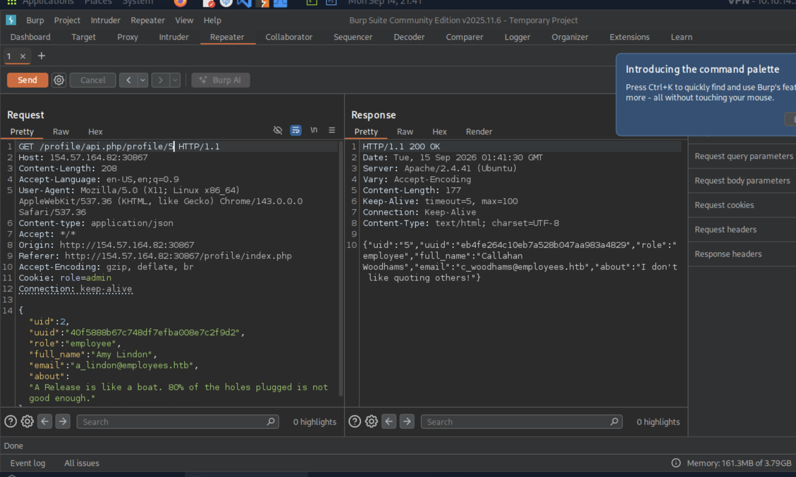

# Section 10: IDOR in Insecure APIs

Module: 23. Web Attacks

---

## Questions & Answers

### 1. Try to read the details of the user with 'uid=5'. What is their 'uuid' value?

Context:
- Simply change the PUT request to GET and change the uid: `GET /profile/api.php/profile/5 HTTP/1.1`

**Answer:** `eb4fe264c10eb7a528b047aa983a4829`

---

[Back to Module Index](./README.md)
