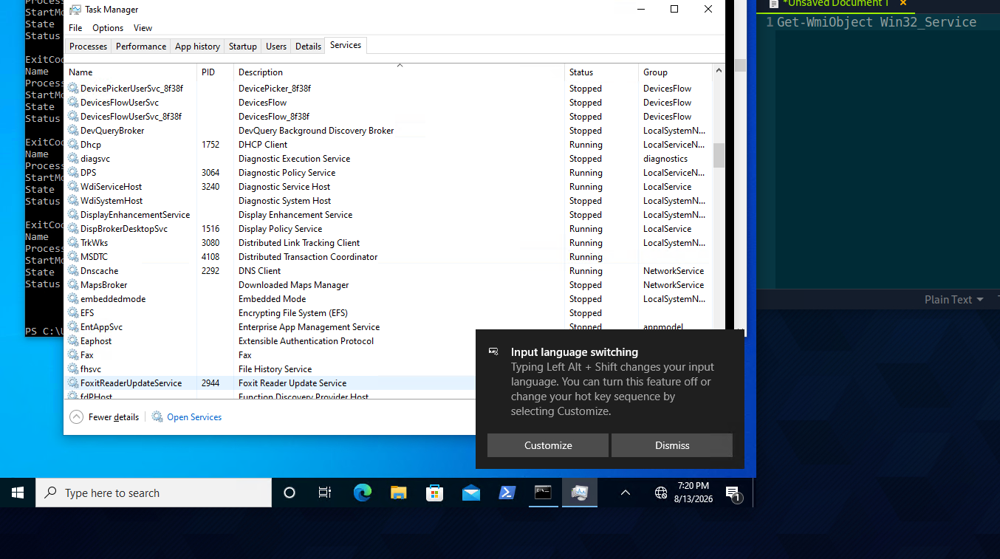

# Section 06: Windows Services & Processes

Optional Module: Windows Fundamentals

---

## Questions & Answers

### 1. Identify one of the non-standard update services running on the host. Submit the full name of the service executable (not the DisplayName) as your answer.

Context:

**Answer:** `FoxitReaderUpdateService.exe`

---

[Back to Module Index](./README.md)
