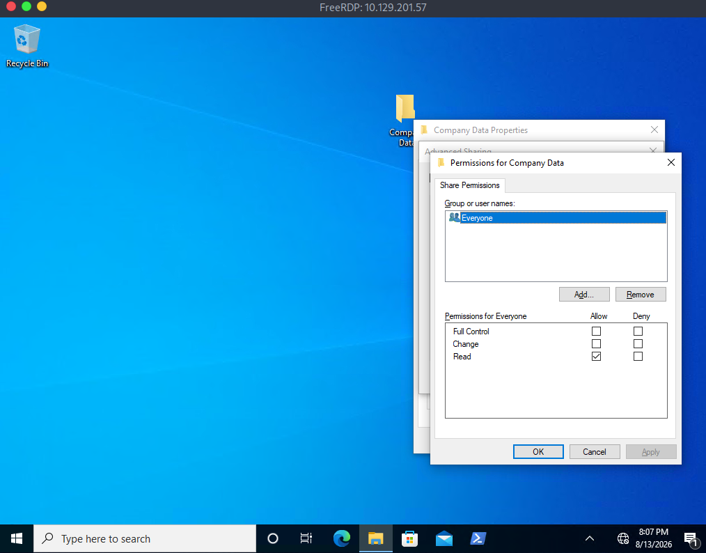

# Section 15: Skills Assessment - Windows Fundamentals

Optional Module: Windows Fundamentals

---

## Questions & Answers

### 1. What is the name of the group that is present in the Company Data Share Permissions ACL by default?

Context:


**Answer:** `Everyone`

---

### 2. What is the name of the tab that allows you to configure NTFS permissions?


**Answer:** `Security`

---

### 3. What is the name of the service associated with Windows Update?

Context:
```powershell
PS C:\Users\htb-student> Get-Service | Where DisplayName -like "windows update"

Status   Name               DisplayName
------   ----               -----------
Running  wuauserv           Windows Update


PS C:\Users\htb-student>
```

**Answer:** `wuauserv`

---

### 4. List the SID associated with the user account Jim you created.

Context:
```powershell
PS C:\Users\htb-student> wmic useraccount get name,sid
Name                SID
Administrator       S-1-5-21-2614195641-1726409526-3792725429-500
bob.smith           S-1-5-21-2614195641-1726409526-3792725429-1003
DefaultAccount      S-1-5-21-2614195641-1726409526-3792725429-503
defaultuser0        S-1-5-21-2614195641-1726409526-3792725429-1000
Guest               S-1-5-21-2614195641-1726409526-3792725429-501
htb-student         S-1-5-21-2614195641-1726409526-3792725429-1002
Jim                 S-1-5-21-2614195641-1726409526-3792725429-1006
mrb3n               S-1-5-21-2614195641-1726409526-3792725429-1001
WDAGUtilityAccount  S-1-5-21-2614195641-1726409526-3792725429-504
```

**Answer:** `S-1-5-21-2614195641-1726409526-3792725429-1006`

---

### 5. List the SID associated with the HR security group you created.

Context:
```cmd
PS C:\Users\htb-student> wmic group get name,sid
Name                                 SID
Access Control Assistance Operators  S-1-5-32-579
Administrators                       S-1-5-32-544
Backup Operators                     S-1-5-32-551
Cryptographic Operators              S-1-5-32-569
Distributed COM Users                S-1-5-32-562
Event Log Readers                    S-1-5-32-573
Guests                               S-1-5-32-546
Hyper-V Administrators               S-1-5-32-578
IIS_IUSRS                            S-1-5-32-568
Network Configuration Operators      S-1-5-32-556
Performance Log Users                S-1-5-32-559
Performance Monitor Users            S-1-5-32-558
Power Users                          S-1-5-32-547
Remote Desktop Users                 S-1-5-32-555
Remote Management Users              S-1-5-32-580
Replicator                           S-1-5-32-552
System Managed Accounts Group        S-1-5-32-581
Users                                S-1-5-32-545
HR                                   S-1-5-21-2614195641-1726409526-3792725429-1007
```

**Answer:** `S-1-5-21-2614195641-1726409526-3792725429-1007`

---

[Back to Module Index](./README.md)
