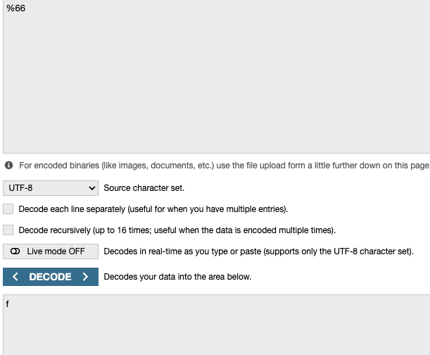
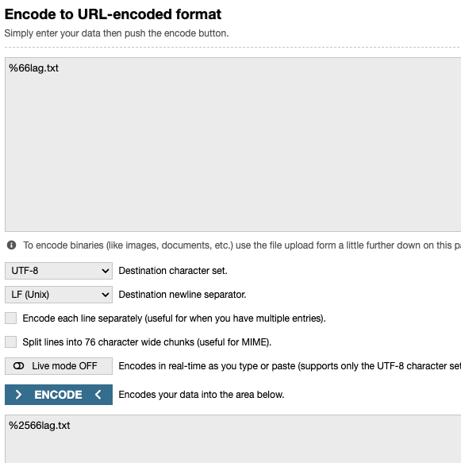
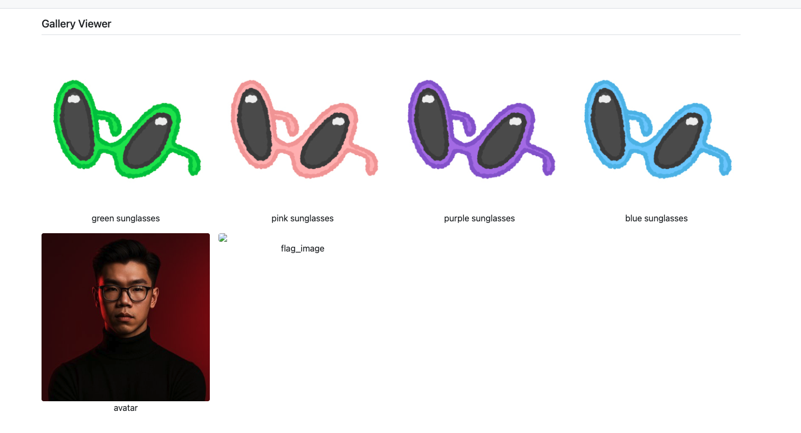
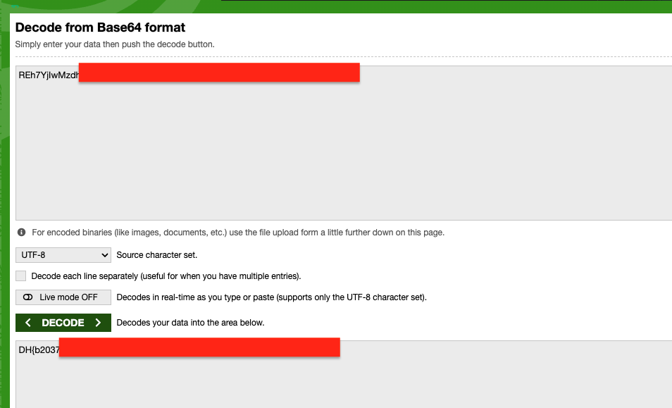

# Dream Gallery — DreamHack

> **Room / Challenge:** Dream Gallery (Web)

---

## Metadata

- **Author:** `jameskaois`
- **CTF:** DreamHack
- **Challenge:** Dream Gallery (web)
- **Link**: `https://dreamhack.io/wargame/challenges/552`
- **Level:** `2`
- **Date:** `19-11-2025`

---

## Goal

The web app is vulnerable to SSRF, leveraging this to get the flag.

## My Solution

The vulnerable part of the app is in the `/request` route:

```python
@app.route('/request')
def url_request():
    url = request.args.get('url', '').lower()
    title = request.args.get('title', '')
    if url == '' or url.startswith("file://") or "flag" in url or title == '':
        return render_template('request.html')

    try:
        data = urlopen(url).read()
        mini_database.append({title: base64.b64encode(data).decode('utf-8')})
        return redirect(url_for('view'))
    except:
        return render_template("request.html")
```

The route checks if url starts with `file://` or `flag` is in url it will blocked from append the image to the `mini_database`, however the app is using `urlopen()` function:

```python
data = urlopen(url).read()
```

This function accepts `file:/` which will works exactly the same with `file://`, and also it can url-decode the input so to browse for `flag.txt`, we can URL-encode the `f` to `%66`:

However, when we send a request with URL-encode the Flask automatically decode this so when it comes to the check `%66lag.txt` will become back to `flag.txt`, the check will deny us. So we have to double URL-encode this:

Final payload:

```
URL: file:/%2566lag.txt
Title: flag
```


Use DevTools to get the base64 encoded and decode it to get the flag:

