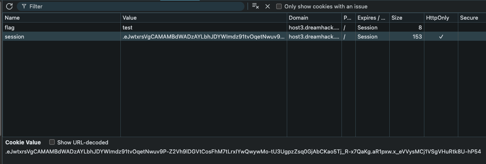
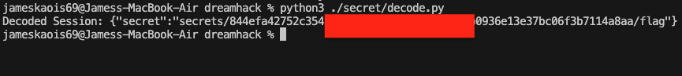

# Secure secret — DreamHack

> **Room / Challenge:** Secure secret (Web)

---

## Metadata

- **Author:** `jameskaois`
- **CTF:** DreamHack
- **Challenge:** Secure secret (web)
- **Link**: `https://dreamhack.io/wargame/challenges/1570`
- **Level:** `2`
- **Date:** `19-11-2025`

---

## Goal

Uncovering the app secret which contains the flag directory and view it.

## My Solution

The `app.py` hides the flag in a really random directory:

```python
flag_dir = SECRETS_PATH + os.urandom(32).hex()
os.mkdir(flag_dir)
flag_path = flag_dir + '/flag'
with open('/flag', 'r') as f0, open(flag_path, 'w') as f1:
    f1.write(f0.read())
```

From this code we know that the flag is in `secrets/......random hex....../flag`. How can we find this?

There is a vulnerable code from the `app.py`:

```python
session['secret'] = flag_path
```

The app sets the `flag_path` right into the client cookie so from getting we can decode it and see the directory where the flag located. Check the cookie of the browser:

Decode the string in Python:

```python
import zlib
import base64

cookie_str = ".eJwtxrsVgCAMAMBdWADzAYLbhJDYWImdz91tvOqetNwuv9P-Z2Vh9lDGVtCosFhM7tLrxIYwQwywMo-tU3UgpzZsq0GjAbCKao5Tj_R-x7QaKg.aR1oqg.aWvxxxxxxxxxxxxxxxx"

payload = cookie_str.split('.')[1]

padding = len(payload) % 4
if padding > 0:
    payload += '=' * (4 - padding)

try:
    decoded_bytes = base64.urlsafe_b64decode(payload)
    decompressed_data = zlib.decompress(decoded_bytes)
    print(f"Decoded Session: {decompressed_data.decode('utf-8')}")
except Exception as e:
    print(f"Error: {e}")
```



Submit the random hex directory `.....random hex...../flag` to the viewer and get the flag:

