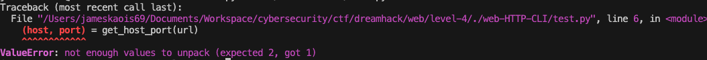
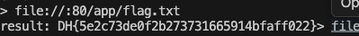

# web-HTTP-CLI — DreamHack

> **Room / Challenge:** web-HTTP-CLI (Web)

---

## Metadata

- **Author:** `jameskaois`
- **CTF:** DreamHack
- **Challenge:** web-HTTP-CLI (web)
- **Link**: `https://dreamhack.io/wargame/challenges/76`
- **Level:** `4`
- **Date:** `27-11-2025`

---

## Goal

Bypassing the filter with the correct URL to get the flag.

## My Solution

The `app.py`:

```python
#!/usr/bin/python3
import urllib.request
import socket

try:
    FLAG = open('./flag.txt', 'r').read()
except:
    FLAG = '[**FLAG**]'

def get_host_port(url):
    return url.split('://')[1].split('/')[0].lower().split(':')


with socket.socket(socket.AF_INET, socket.SOCK_STREAM) as s:
    s.bind(('', 8000))
    s.listen()

    while True:
        try:
            cs, ca = s.accept()
            cs.sendall('[Input Example]\n'.encode())
            cs.sendall('> https://dreamhack.io:443/\n'.encode())
        except:
            continue
        while True:
            cs.sendall('> '.encode())
            url = cs.recv(1024).decode().strip()
            print(url)
            if len(url) == 0:
                break
            try:
                (host, port) = get_host_port(url)
                if 'localhost' == host:
                    cs.sendall('cant use localhost\n'.encode())
                    continue
                if 'dreamhack.io' != host:
                    if '.' in host:
                        cs.sendall('cant use .\n'.encode())
                        continue
                cs.sendall('result: '.encode() + urllib.request.urlopen(url).read())
            except:
                cs.sendall('error\n'.encode())
        cs.close()
```

It will check our input URL before using `urllib` to open our URL:

```python
(host, port) = get_host_port(url)
if 'localhost' == host:
    cs.sendall('cant use localhost\n'.encode())
    continue
if 'dreamhack.io' != host:
    if '.' in host:
        cs.sendall('cant use .\n'.encode())
        continue
cs.sendall('result: '.encode() + urllib.request.urlopen(url).read())
```

The primary function used to check is the `get_host_port(url)`:

```python
def get_host_port(url):
    return url.split('://')[1].split('/')[0].lower().split(':')
```

To be more easily to test we can copy the code to another file to test:

```python
url = "INPUT_URL"

def get_host_port(url):
    return url.split('://')[1].split('/')[0].lower().split(':')

(host, port) = get_host_port(url)
if 'localhost' == host:
    print('cant use localhost\n'.encode())
if 'dreamhack.io' != host:
    if '.' in host:
        print('cant use .\n'.encode())

```

The target file content is located in `/app/flag.txt`, so the target is `file:///app/flag.txt`. However run this in test Python script got error:

The function just returns 1 value instead of 2 for this we can change the target: `file://:80/app/flag.txt`. By this we can not only bypass the filter but also make `urllib` fetch the correct content of the system since `:80` will be bypassed by `urllib` because it is fetching local content.


