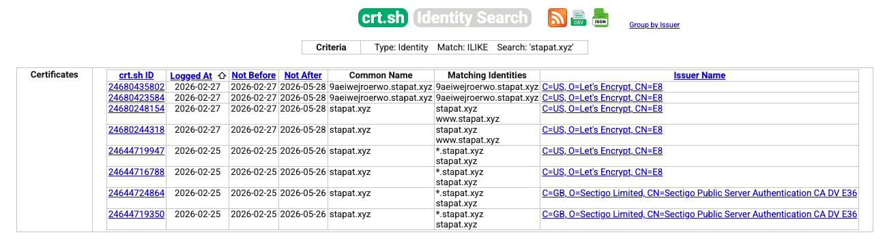
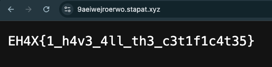

# I can also do it — EHAX CTF 2026

> **Room / Challenge:** I can also do it (miscellaneous)

---

## Metadata

- **Author:** `jameskaois`
- **CTF:** EHAX CTF 2026
- **Challenge:** I can also do it (miscellaneous)
- **Target / URL:** `https://stapat.xyz/`
- **Points:** `50`
- **Date:** `01-03-2026`

---

## Goal

Doing some reconnaissance and check the certificates of the webiste.

## My Solution

Empty details, we have to research about this website by our own to get the flag. After some attempts, I use the service crt.sh to check the certificates of the website and found a hidden domain:

Hidden domain: 9aeiwejroerwo.stapat.xyz, visit this website to get the flag

