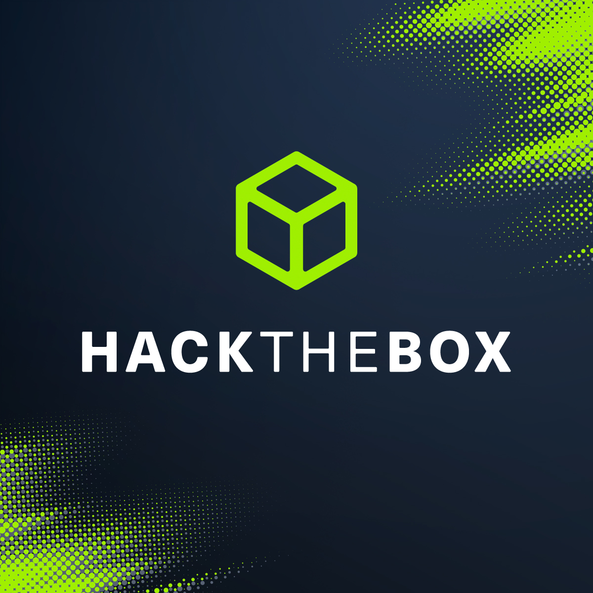

# HackTheBox Writeups

## Challenges Covered

This is my write-ups about machines/challenges/fortresses on HackTheBox:

### Machines

#### Linux
- [Cohort (Easy)](./machines/linux/easy/cohort.md)
- [Connected (Easy)](./machines/linux/easy/connected.md)
- [Enigma (Easy)](./machines/linux/easy/enigma.md)
- [Nexus (Easy)](./machines/linux/easy/nexus.md)
- [Orion (Easy)](./machines/linux/easy/orion.md)
- [Paperwork (Easy)](./machines/linux/easy/paperwork.md)
- [Reactor (Easy)](./machines/linux/easy/reactor.md)
- [Abducted (Medium)](./machines/linux/medium/abducted.md)
- [Bedside (Medium)](./machines/linux/medium/bedside.md)
- [DevArea (Medium)](./machines/linux/medium/devarea.md)
- [DevHub (Medium)](./machines/linux/medium/devhub.md)
- [FireFlow (Medium)](./machines/linux/medium/fireflow.md)
- [Helix (Medium)](./machines/linux/medium/helix.md)
- [Principal (Medium)](./machines/linux/medium/principal.md)
- [SmartHire (Medium)](./machines/linux/medium/smarthire.md)
- [Snapped (Hard)](./machines/linux/hard/snapped.md)
- [Cobblestone (Insane)](./machines/linux/insane/cobblestone.md)

#### Windows
- [Support (Easy)](./machines/windows/easy/support.md)
- [DarkZeroReturns (Hard)](./machines/windows/hard/darkzeroreturns.md)

### Challenges
- [Space Explorer (Very Easy)](./challenges/space-explorer.md)

### Fortresses
- [Akerva](./fortresses/akerva.md)
- [Jet](./fortresses/jet.md)
- [Faraday](./fortresses/faraday.md)