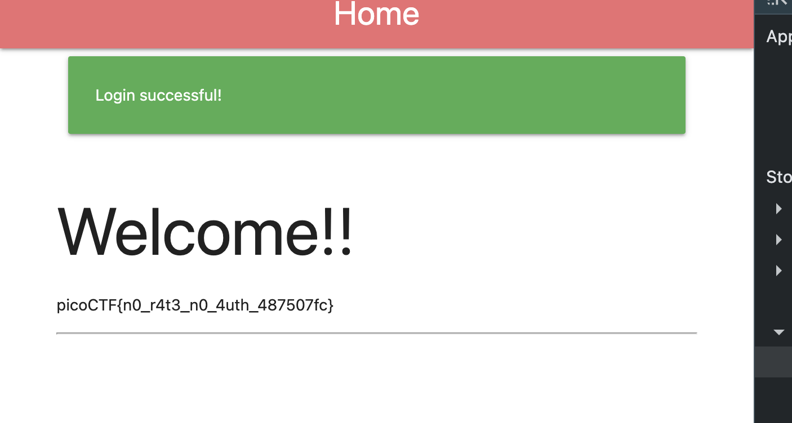

# No FA — Pico CTF 2026

> **Room / Challenge:** No FA (Web)

---

## Metadata

- **CTF:** Pico CTF 2026
- **Challenge:** No FA (web)
- **Target / URL:** `https://play.picoctf.org/events/79/challenges/765?category=1&page=1`

---

## Goal

Pass the 2-step verfication step and get the flag.

## My Solution

The challenge asks us to bypass the 2-step verification to get the flag. However, it has a vulnerability in login route, if the `two_fa` in user row is enabled, the server will get a otp and set it to the session and sent back to the client:

```python
if user['two_fa']:
    # Generate OTP
    otp = str(random.randint(1000, 9999))
    session['otp_secret'] = otp
    session['otp_timestamp'] = time.time()
    session['username'] = username
    session['logged'] = 'false'
    # send OTP to mail ---
    return redirect(url_for('two_fa'))
```

By this, we can decode the session cookie sent by server to bypass the verification process. We can take the admin password in `users.db` and decode it with SHA256: `admin:apple@123`.

Log in with that credentials and take the cookie from server to get the OTP. I use `flask-unsign` to decode it:

```bash
flask-unsign --decode --cookie '<cookie>'

{'logged': 'false', 'otp_secret': '9864', 'otp_timestamp': 1773472317.4661577, 'username': 'admin'}
```

Use that OTP to login and get the flag:

Flag: `picoCTF{n0_r4t3_n0_4uth_487507fc}`
