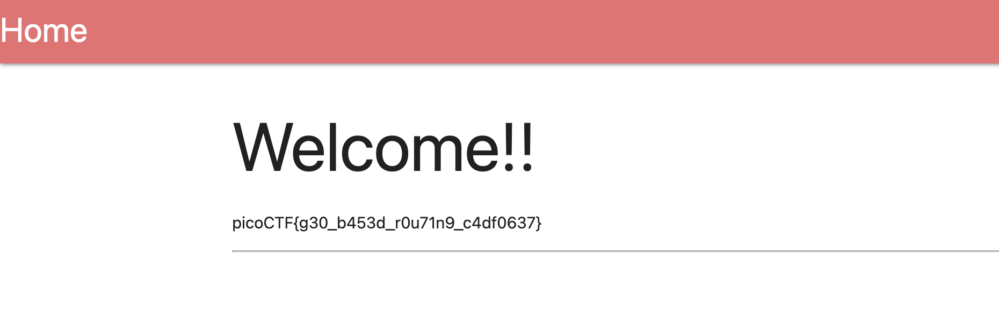

# North-South — Pico CTF 2026

> **Room / Challenge:** North-South (Web)

---

## Metadata

- **CTF:** Pico CTF 2026
- **Challenge:** North-South (web)
- **Target / URL:** `https://play.picoctf.org/events/79/challenges/725?category=1&page=1`

---

## Goal

Access from the desired location to get the flag.

## My Solution

The `nginx.conf` given by the challenge:

```conf
load_module /usr/lib/nginx/modules/ngx_http_geoip2_module.so;

worker_processes 1;
events { worker_connections 1024; }

http {
    include       mime.types;
    default_type  application/octet-stream;

    geoip2 /etc/nginx/GeoLite2-Country.mmdb {
        auto_reload 5m;
        $geoip2_data_country_code default=ZZ country iso_code;
    }

    upstream north {
        server 127.0.0.1:8000;
    }

    upstream south {
        server 127.0.0.1:9000;
    }

    server {
        listen 80;

        location / {
            if ($geoip2_data_country_code = IS) {
                proxy_pass http://south;
            }

            proxy_pass http://north;
        }
    }
}
```

As we can see if our request is from `IS` which is Iceland it will pass us to `http://south` otherwise will be `http://north`.

```
location / {
    if ($geoip2_data_country_code = IS) {
        proxy_pass http://south;
    }

    proxy_pass http://north;
}
```

I use Urban VPN Proxy extension from Google to choose the location Iceland then get access to the challenge and successfully got the flag.

Flag: `picoCTF{g30_b453d_rOu71n9_c4df0637}`
