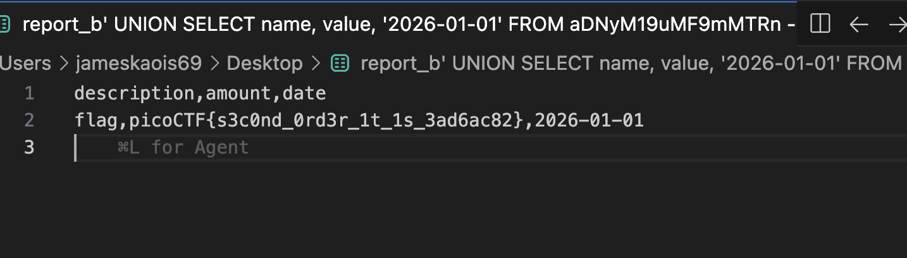

# ORDER ORDER — Pico CTF 2026

> **Room / Challenge:** ORDER ORDER (Web)

---

## Metadata

- **CTF:** Pico CTF 2026
- **Challenge:** ORDER ORDER (web)
- **Target / URL:** `https://play.picoctf.org/practice/challenge/752?category=1&originalEvent=79&page=1`

---

## Goal

Leveraging SQL Injection vulnerability to get the flag.

## My Solution

Solve path:

1. Register a new account with this username:

```
b' UNION SELECT name, value, '2026-01-01' FROM aDNyM19uMF9mMTRn --
```

2. Use any email and password. This payload matches the 3 CSV columns and dumps the suspicious hidden table that writeups identified.
3. Log in with that account.
4. Go to Expenses and click Generate Report.
5. Wait for the report to appear in Inbox, then download it. Public writeups show the CSV comes back like:



Flag: `picoCTF{s3c0nd_0rd3r_1t_1s_3ad6ac82}`
