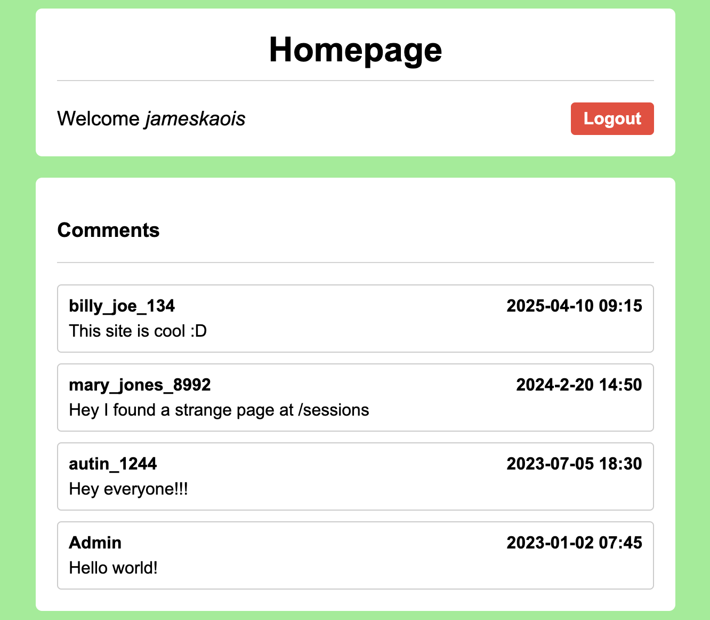
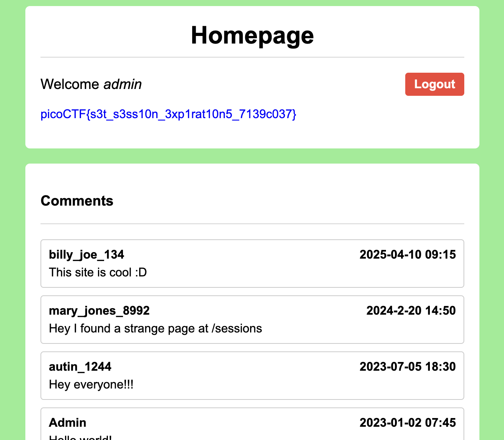

# Old Sessions — Pico CTF 2026

> **Room / Challenge:** Old Sessions (Web)

---

## Metadata

- **CTF:** Pico CTF 2026
- **Challenge:** Old Sessions (web)
- **Target / URL:** `https://play.picoctf.org/events/79/challenges/739?category=1&page=1`

---

## Goal

Grant admin priviledges through cookie to get the flag.

## My Solution

Tried registering and logging in, we'll see 4 comments, a comment leading us to `/session`

Go to `/sessions` saw a session key of admin, use this and change our cookie, go back to home page and get the flag.

Flag: `picoCTF{s3t_s3ss10n_3xp1rat10n5_7139c037}`
