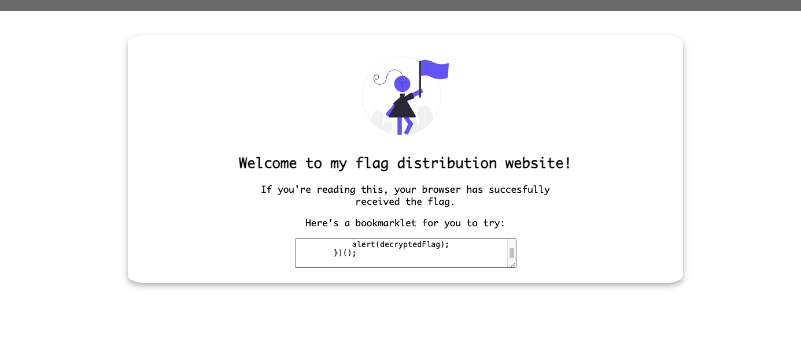
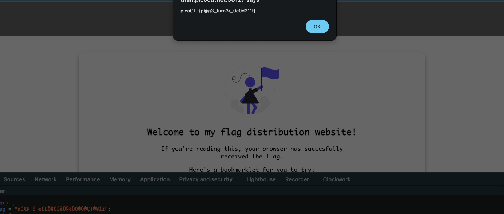

# Bookmarklet — Pico Gym

> **Room / Challenge:** Bookmarklet (Web)

---

## Metadata

- **Author:** `jameskaois`
- **CTF:** Pico Gym
- **Challenge:** Bookmarklet (web)
- **Link**: `https://play.picoctf.org/practice/challenge/406`
- **Difficulty:** `Easy`
- **Date:** `07-11-2025`

---

## Goal

Get the flag by using the bookmarklet.

## My Solution

The website has a bookmarklet, there is a JavaScript code:



```javascript
javascript: (function () {
  var encryptedFlag = "àÒÆަȬë٣֖ÓÚåÛÑ¢ÕӖәǡ”¥Ìí";
  var key = "picoctf";
  var decryptedFlag = "";
  for (var i = 0; i < encryptedFlag.length; i++) {
    decryptedFlag += String.fromCharCode(
      (encryptedFlag.charCodeAt(i) - key.charCodeAt(i % key.length) + 256) % 256
    );
  }
  alert(decryptedFlag);
})();
```

We can simply paste this to the browser console and run it to get the flag:



Flag: `picoCTF{p@g3_turn3r_0c0d211f}`
