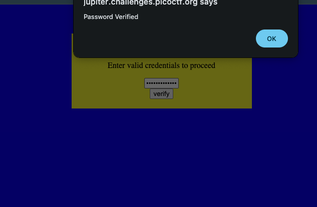

# dont-use-client-side — Pico Gym

> **Room / Challenge:** dont-use-client-side (Web)

---

## Metadata

- **Author:** `jameskaois`
- **CTF:** Pico Gym
- **Challenge:** dont-use-client-side (web)
- **Link**: `https://play.picoctf.org/practice/challenge/66`
- **Difficulty:** `Easy`
- **Date:** `07-11-2025`

---

## Goal

Understanding and decoded the hash algorithm to get the flag.

## My Solution

The website UI:


View the page source got this algorithm:

```javascript
function verify() {
  checkpass = document.getElementById("pass").value;
  split = 4;
  if (checkpass.substring(0, split) == "pico") {
    if (checkpass.substring(split * 6, split * 7) == "723c") {
      if (checkpass.substring(split, split * 2) == "CTF{") {
        if (checkpass.substring(split * 4, split * 5) == "ts_p") {
          if (checkpass.substring(split * 3, split * 4) == "lien") {
            if (checkpass.substring(split * 5, split * 6) == "lz_7") {
              if (checkpass.substring(split * 2, split * 3) == "no_c") {
                if (checkpass.substring(split * 7, split * 8) == "e}") {
                  alert("Password Verified");
                }
              }
            }
          }
        }
      }
    }
  } else {
    alert("Incorrect password");
  }
}
```

The `checkpass` value will be checked and the string here is really likely the flag, I tried and used different methods and combine them to get the flag: `picoCTF{no_clients_plz_7723ce}`

We can check this in the credential and got `Password verified`


