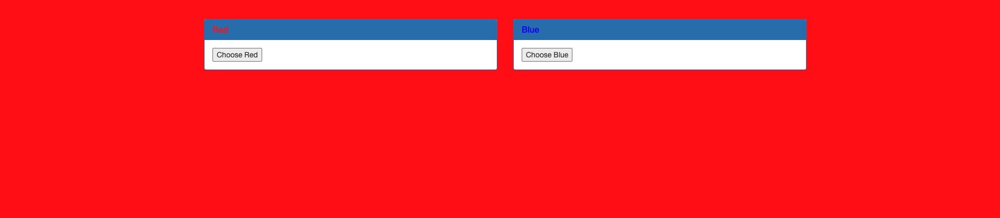

# GET aHEAD — Pico Gym

> **Room / Challenge:** GET aHEAD (Web)

---

## Metadata

- **Author:** `jameskaois`
- **CTF:** Pico Gym
- **Challenge:** GET aHEAD (web)
- **Link**: `https://play.picoctf.org/practice/challenge/132`
- **Difficulty:** `Easy`
- **Date:** `07-11-2025`

---

## Goal

## My Solution

The website home page has two buttons choose blue and red which is the background color.



This is the source code:

```html
<!DOCTYPE html>
<html>
  <head>
    <title>Red</title>
    <link
      rel="stylesheet"
      type="text/css"
      href="//maxcdn.bootstrapcdn.com/bootstrap/3.3.5/css/bootstrap.min.css"
    />
    <style>
      body {
        background-color: red;
      }
    </style>
  </head>
  <body>
    <div class="container">
      <div class="row">
        <div class="col-md-6">
          <div class="panel panel-primary" style="margin-top:50px">
            <div class="panel-heading">
              <h3 class="panel-title" style="color:red">Red</h3>
            </div>
            <div class="panel-body">
              <form action="index.php" method="GET">
                <input type="submit" value="Choose Red" />
              </form>
            </div>
          </div>
        </div>
        <div class="col-md-6">
          <div class="panel panel-primary" style="margin-top:50px">
            <div class="panel-heading">
              <h3 class="panel-title" style="color:blue">Blue</h3>
            </div>
            <div class="panel-body">
              <form action="index.php" method="POST">
                <input type="submit" value="Choose Blue" />
              </form>
            </div>
          </div>
        </div>
      </div>
    </div>
  </body>
</html>
```

GET method will return red bg color, POST method will return blue bg color. I tried other methods PUT, PATCH, DELETE,... but got ? color. Looking at the title `GET aHEAD` tried a HEAD request.

```bash
curl -I http://mercury.picoctf.net:47967/index.php

HTTP/1.1 200 OK
flag: picoCTF{r3j3ct_th3_du4l1ty_cca66bd3}
Content-type: text/html; charset=UTF-8
```

Flag: `picoCTF{r3j3ct_th3_du4l1ty_cca66bd3}`
