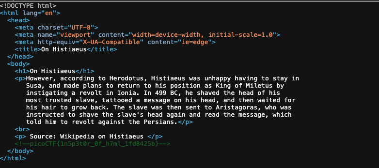

# Inspect HTML — Pico Gym

> **Room / Challenge:** Inspect HTML (Web)

---

## Metadata

- **Author:** `jameskaois`
- **CTF:** Pico Gym
- **Challenge:** Inspect HTML (web)
- **Link**: `https://play.picoctf.org/practice/challenge/275`
- **Difficulty:** `Easy`
- **Date:** `07-11-2025`

---

## Goal

Inspecting the HTML to get the flag.

## My Solution

The website is simple, we just need to view the source to get the flag:

Flag: `picoCTF{1n5p3t0r_0f_h7ml_1fd8425b}`
