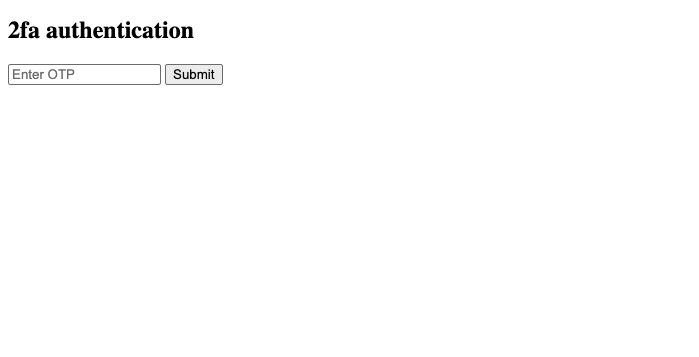
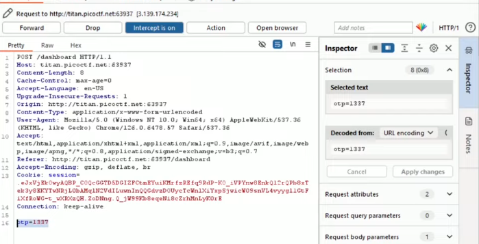
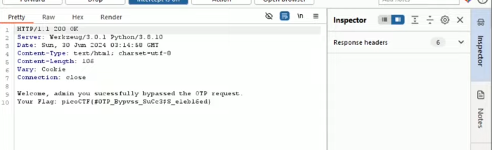

# IntroToBurp — Pico Gym

> **Room / Challenge:** IntroToBurp (Web)

---

## Metadata

- **Author:** `jameskaois`
- **CTF:** Pico Gym
- **Challenge:** IntroToBurp (web)
- **Link**: `https://play.picoctf.org/practice/challenge/419`
- **Difficulty:** `Easy`
- **Date:** `07-11-2025`

---

## Goal

Use Burp Suite to bypass the authentication got the flag.

## My Solution

The app has a registeration form:

Tried registering a random account, it takes us to an OTP form:

Use Burp Suite to intercept this request before it sends the OTP:

Then we can get the flag:

