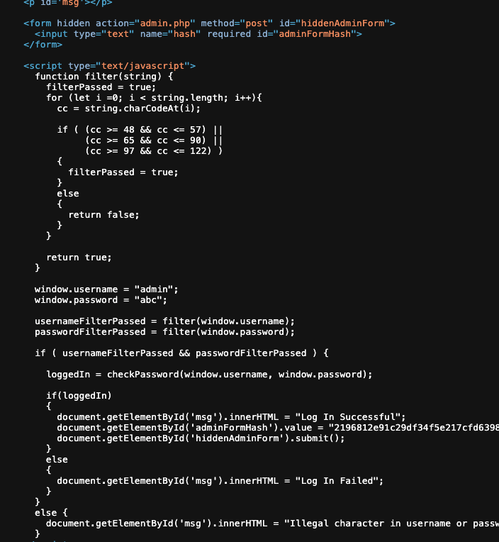
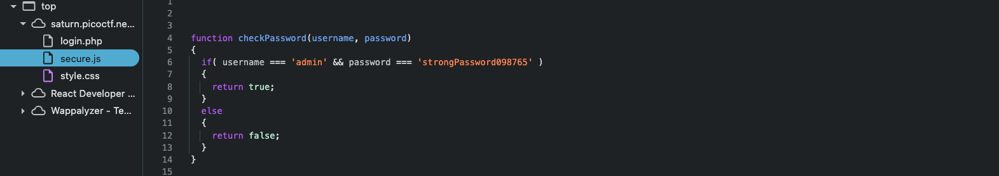

# Local Authority — Pico Gym

> **Room / Challenge:** Local Authority (Web)

---

## Metadata

- **Author:** `jameskaois`
- **CTF:** Pico Gym
- **Challenge:** Local Authority (web)
- **Link**: `https://play.picoctf.org/practice/challenge/278`
- **Difficulty:** `Easy`
- **Date:** `07-11-2025`

---

## Goal

Examining deep the website to get the correct credentials and capture the flag.

## My Solution

The home page has a customer portal:

There is no hints in this website, so just tried logging in and view the page source of the `login.php`

Also the page has a linked file `secure.js`, view its content we got the username and password:

Login with that credentials got the flag: `picoCTF{j5_15_7r4n5p4r3n7_a8788e61}`
