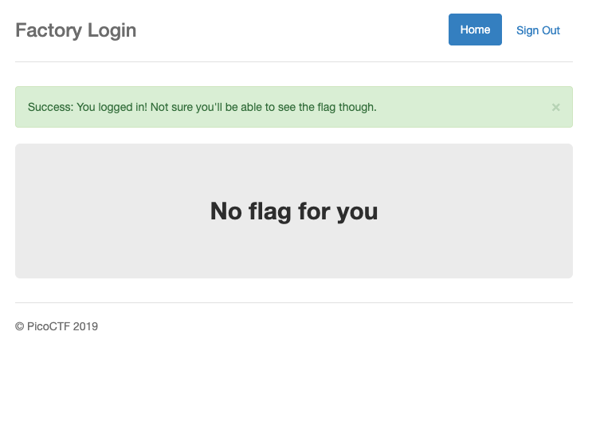
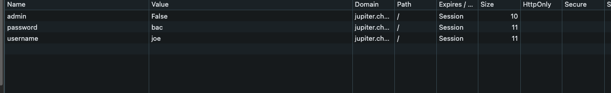
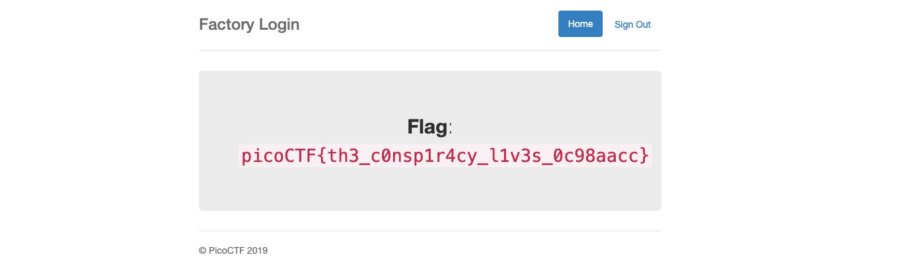

# logon — Pico Gym

> **Room / Challenge:** logon (Web)

---

## Metadata

- **Author:** `jameskaois`
- **CTF:** Pico Gym
- **Challenge:** logon (web)
- **Link**: `https://play.picoctf.org/practice/challenge/46`
- **Difficulty:** `Easy`
- **Date:** `07-11-2025`

---

## Goal

Examining deep the website to get the correct credentials and capture the flag.

## My Solution

We need to login as Joe I tried username joe and abc password:

Check the cookies:

Change the admin to `True` we can easily get the flag:

Flag: `picoCTF{th3_c0nsp1r4cy_l1v3s_0c98aacc}`
