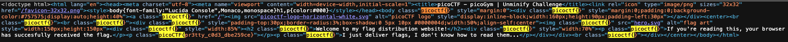
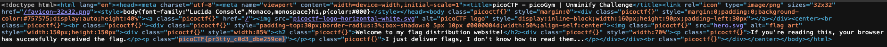

# Unminify — Pico Gym

> **Room / Challenge:** Unminify (Web)

---

## Metadata

- **Author:** `jameskaois`
- **CTF:** Pico Gym
- **Challenge:** Unminify (web)
- **Link**: `https://play.picoctf.org/practice/challenge/426`
- **Difficulty:** `Easy`
- **Date:** `07-11-2025`

---

## Goal

The app is minified however it is still possible to get the flag.

## My Solution

We can easily see that the website is minified, we can see that by view the website's source:

The flag appears right there:

Flag: `picoCTF{pr3tty_c0d3_dbe259ce}`
