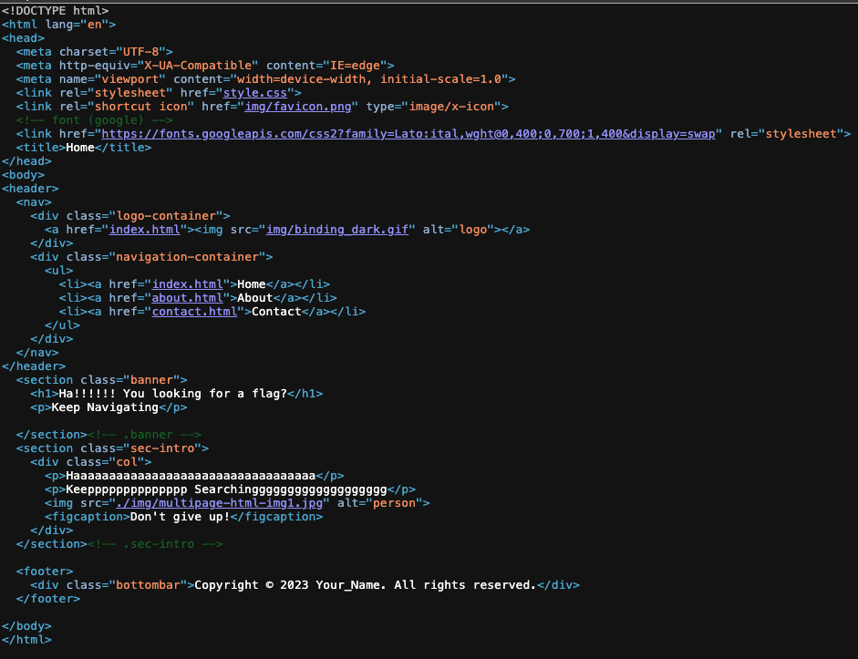
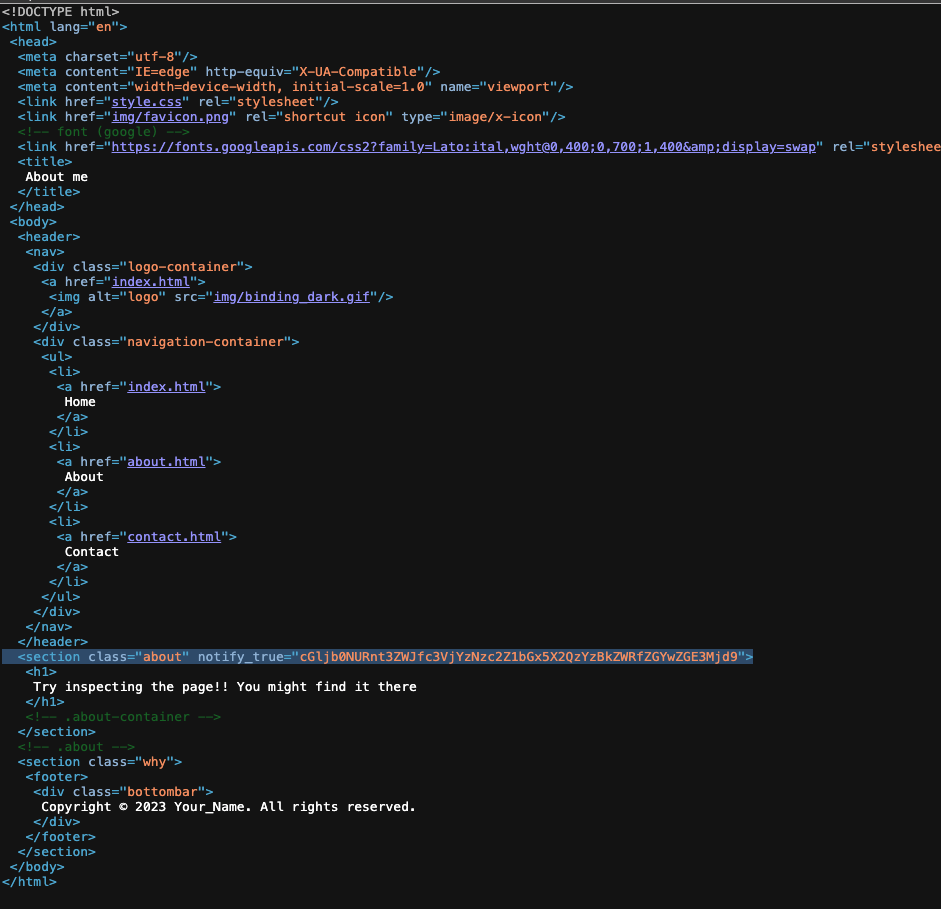
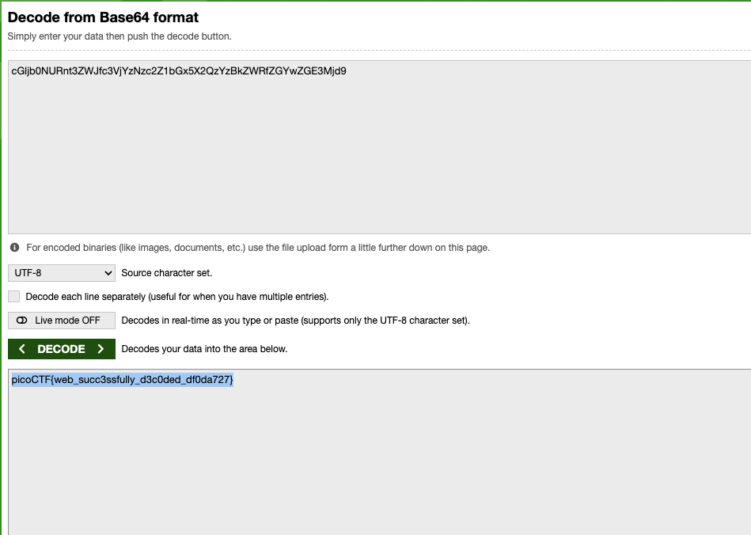

# WebDecode — Pico Gym

> **Room / Challenge:** WebDecode (Web)

---

## Metadata

- **Author:** `jameskaois`
- **CTF:** Pico Gym
- **Challenge:** WebDecode (web)
- **Link**: `https://play.picoctf.org/practice/challenge/427`
- **Difficulty:** `Easy`
- **Date:** `07-11-2025`

---

## Goal

Inspecting the website to get the flag.

## My Solution

The description of the challenge is clear we have to use the inspector to solve this challenge. In the home page click `View page source`:



But got nothing, tried inspecting the `about.html` page:



We got a hint:

```html
<section
  class="about"
  notify_true="cGljb0NURnt3ZWJfc3VjYzNzc2Z1bGx5X2QzYzBkZWRfZGYwZGE3Mjd9"
></section>
```

I tried decode with base64 that string and got the flag:



```
picoCTF{web_succ3ssfully_d3c0ded_df0da727}
```
