# TryHackMe CTF Journey

This repository contains my personal notes, writeups, and lessons learned from completing various TryHackMe rooms and challenges.  
The focus is on documenting approaches, tools, and techniques that I used to solve each task, while keeping the writeups educational and easy to follow.

## Rooms/CTFs Covered

- [Active Reconnaissance](./active-reconnaissance.md)
- [Advent of Cyber 2024](./advent-of-cyber-2024.md)
- [Learning Cyber Security](./beginner-path-intro.md)
- [Blue](./blue.md)
- [Careers In Cyber](./careers-in-cyber.md)
- [Common Attacks](./common-attacks.md)
- [Cyber Kill Chain](./cyber-kill-chain.md)
- [Defensive Security Intro](./defensive-security-intro.md)
- [Dectecting Web Attacks](./detecting-web-attacks.md)
- [DNS In Detail](./dns-in-detail.md)
- [Further Nmap](./further-nmap.md)
- [Getting Started](./getting-started.md)
- [Google Dorking](./google-dorking.md)
- [HTTPS In Detail](./http-in-detail.md)
- [Hydra](./hydra.md)
- [Input Manipulation & Prompt Injection](./input-manipulation-prompt-injection.md)
- [Intro To Networking](./intro-to-networking.md)
- [Intro To Digital Forensics](./intro-to-digital-forensics.md)
- [Intro To IaC](./intro-to-iac.md)
- [Intro To Research](./intro-to-research.md)
- [Junior Security Analyst Intro](./junior-security-analyst-intro.md)
- [Linux Fundamentals Part 1](./linux-fundamentals-part-1.md)
- [Linux Modules](./linux-modules.md)
- [Linux PrivEsc](./linux-privesc.md)
- [Linux Privilege Escalation](./linux-privilege-escalation.md)
- [Linux Strength Training](./linux-strength-training.md)
- [Network Services](./network-services.md)
- [Network Services 2](./network-services-2.md)
- [Network Traffic Basics](./network-traffic-basics.md)
- [Offensive Security Intro 2](./offensive-security-intro-2.md)
- [Offensive Security Intro](./offensive-security-intro.md)
- [OHSINT](./ohsint.md)
- [OpenVPN](./openvpn.md)
- [OWASP Top 10](./owasp-top-10.md)
- [OWASP Top 10 2021](./owasp-top-10-2021.md)
- [Passive Reconnaissance](./passive-reconnaissance.md)
- [Pentesting Fundamentals](./pentesting-fundamentals.md)
- [Putting It All Together](./putting-it-all-together.md)
- [Pyramid Of Pain](./pyramid-of-pain.md)
- [Red Team Fundamentals](./red-team-fundamentals.md)
- [Red Team OPSEC](./red-team-opsec.md)
- [Search Skills](./search-skills.md)
- [Security Principles](./security-principles.md)
- [SQL Injection](./sql-injection.md)
- [Starting Out In Cyber Sec](./starting-out-in-cyber-sec.md.md)
- [The Hacker Methodology](./the-hacker-methodology.md)
- [Toolbox: Vim](./toolbox-vim.md)
- [Unified Kill Chain](./unified-kill-chain.md)
- [Web Application Security](./web-application-security.md)
- [What Is Networking](./whatisnetworking.md)
- [Windows Fundamentals 1](./windows-fundamentals-1.md)
- [Windows Fundamentals 2](./windows-fundamentals-2.md)
- [Windows Fundamentals 3](./windows-fundamentals-3.md)

## TryHackMe Badges

|  | [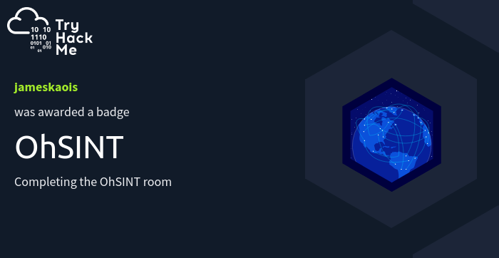](https://tryhackme.com/jameskaois/badges/ohsint) |
| -------------------------------------------------------------------------------------------------- | -------------------------------------------------------------------------------- |
| _cat linux.txt_                                                                                    | _OHSINT_                                                                         |

| [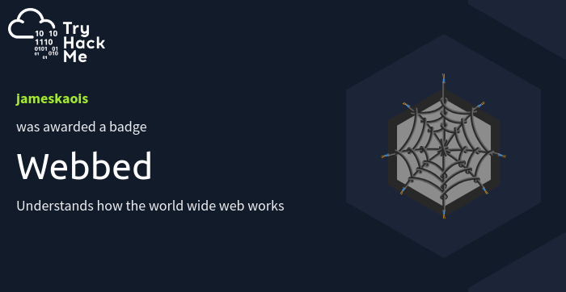](https://tryhackme.com/jameskaois/badges/web-fund) | [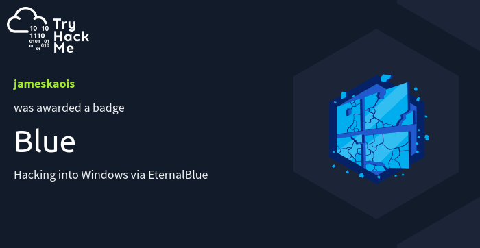](https://tryhackme.com/jameskaois/badges/blue) |
| ------------------------------------------------------------------------------------ | -------------------------------------------------------------------------- |
| _Web Fund_                                                                           | _Blue_                                                                     |

| [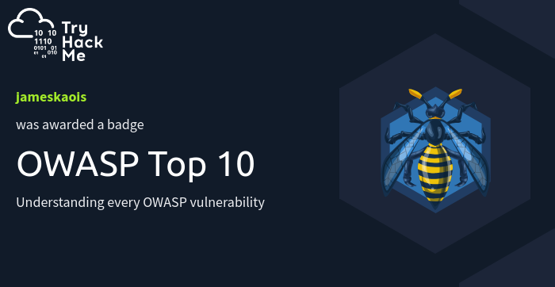](https://tryhackme.com/jameskaois/badges/owasp-10) | [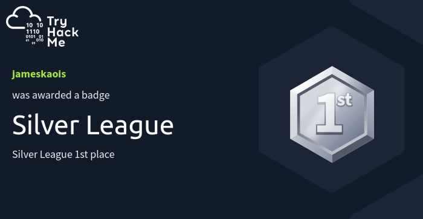](https://tryhackme.com/jameskaois/badges/silver-league) |
| ------------------------------------------------------------------------------------------ | --------------------------------------------------------------------------------------------------------- |
| _OWASP Top 10_                                                                             | _1st Silver League_                                                                                       |

| [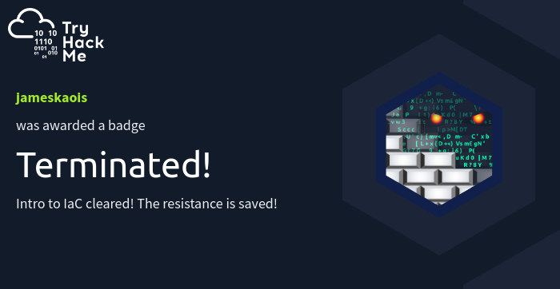](https://tryhackme.com/jameskaois/badges/iac-security) | [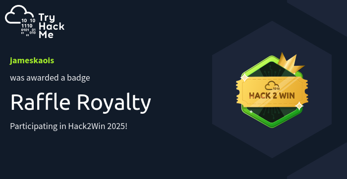](https://tryhackme.com/jameskaois/badges/raffle-royalty) |
| -------------------------------------------------------------------------------------------------- | -------------------------------------------------------------------------------------------------------- |
| _IaC Security_                                                                                     | _Raffle Royalty_                                                                                         |

| [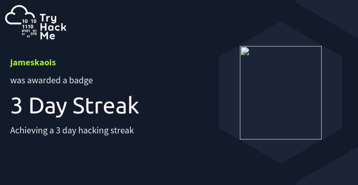](https://tryhackme.com/jameskaois/badges/3-day-streak) | [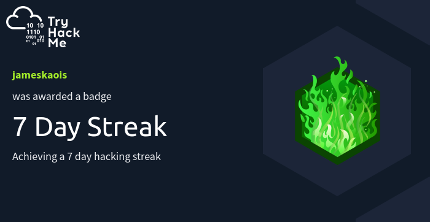](https://tryhackme.com/jameskaois/badges/7-day-streak) |
| -------------------------------------------------------------------------------------------------- | -------------------------------------------------------------------------------------------------- |
| _3 Day Streak_                                                                                     | _7 Day Streak_                                                                                     |

| [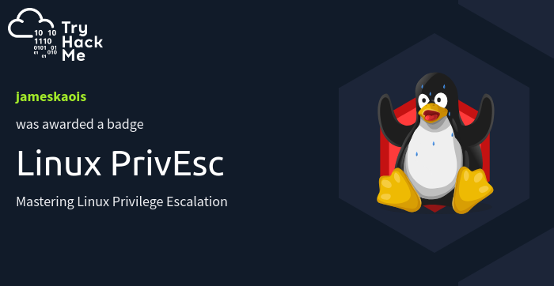](https://tryhackme.com/jameskaois/badges/linux-privesc) |  |
| ----------------------------------------------------------------------------------------------------- | -------------------------------------------------------------------------------------------------------- |
| _Linux PrivEsc_                                                                                       | _World Wide Web_                                                                                         |

| [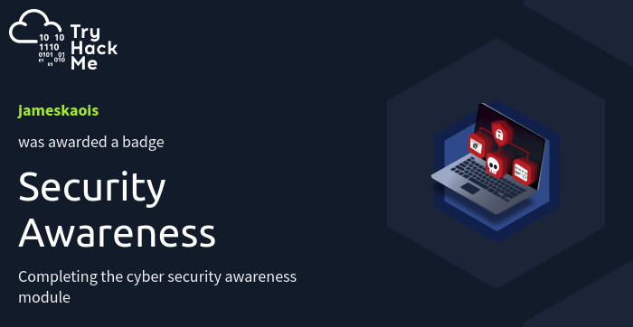](https://tryhackme.com/jameskaois/badges/security-awareness) |  |
| -------------------------------------------------------------------------------------------------------------------- | --------- |
| _Security Awareness_                                                                                                 | \_\_      |

## Disclaimer

These writeups are for **educational purposes only**.  
They are meant to serve as **hints and learning notes**. The goal is to encourage learning, problem-solving, and critical thinking while progressing through TryHackMe challenges.
