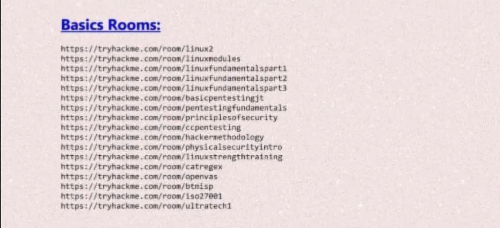

# Basics Rooms

## About
Linux basics, networking fundamentals, and introductory cybersecurity concepts.

## Rooms Covered

## Navigation
- [Linux Modules](./linux-modules.md)
- [Linux Fundamentals Part 1](./linux-fundamentals-part-1.md)